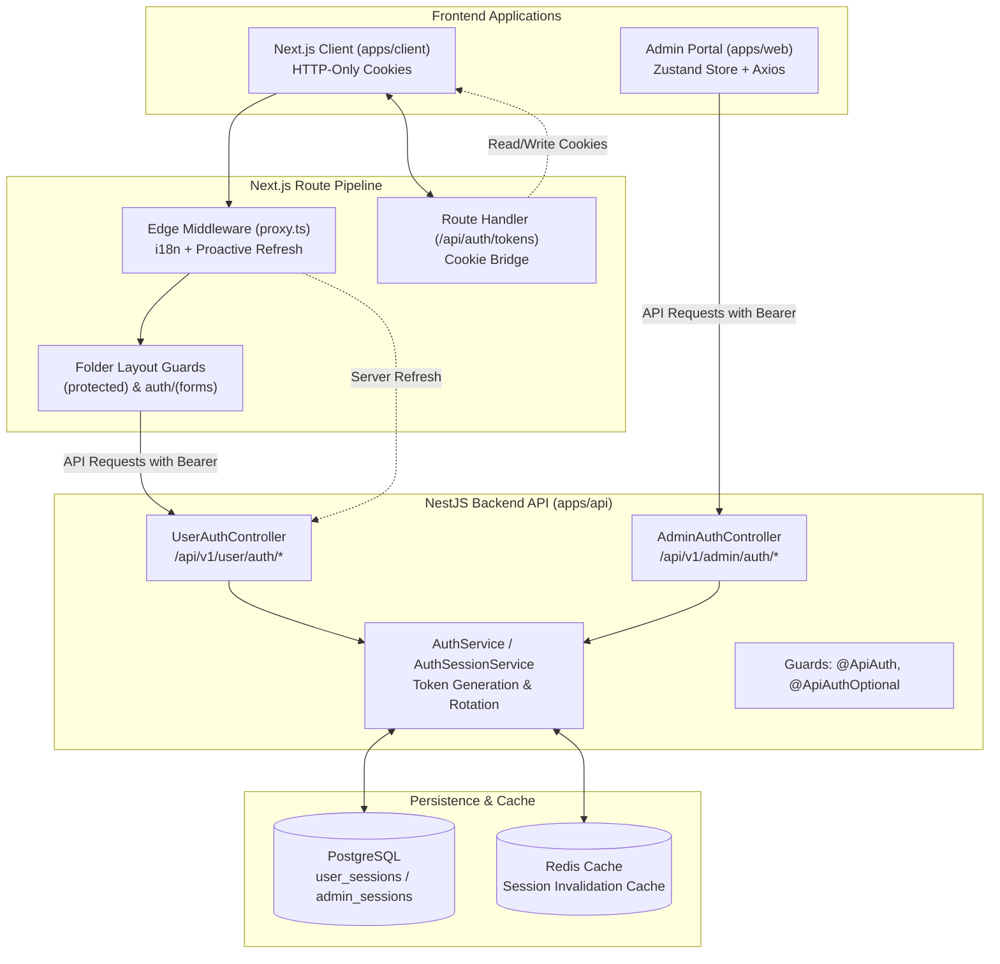

# Authentication Architecture & Developer Guide

> **English** | [Tiếng Việt](AUTH.vi.md)
>
> **Enterprise-Grade Authentication & Session Lifecycle** across the Monorepo (`apps/api`, `apps/client`, `apps/web`), featuring Refresh Token Rotation (RTR), Single-Flight Concurrency Control, Zero-Trick Route Protection, and Resilient Error Handling.

---

## 1. Architecture Overview

This monorepo implements a decoupled, highly secure authentication architecture designed for modern fullstack applications:

1. **Backend (`apps/api`)**: NestJS REST API with PostgreSQL session persistence, TypeORM, Redis caching, and Passport JWT strategies supporting dual personas (`user` and `admin`).
2. **Web Client (`apps/client`)**: Next.js App Router website using HTTP-only cookies, edge middleware for proactive token refreshes, folder-based layout guards, and single-flight client interceptors.
3. **Admin Portal (`apps/web`)**: Vite + React SPA using in-memory state with localStorage hydration, CASL permissions matrix, and single-flight Axios interceptors.



---

## 2. Core Architectural Principles (No Tricks)

The authentication architecture adheres strictly to clean software engineering and monorepo standards:

1. **No URL Parameter Hacks**: No query flags such as `?force=true` or synthetic request headers like `x-auth-force-login: 1` are used to control auth flows.
2. **Clear Separation of Concerns**:
   - **Middleware (`proxy.ts`)**: Handles internationalization routing (`next-intl`), path forwarding (`x-pathname`), and proactive token renewal. Middleware does **not** maintain hardcoded lists of protected routes or perform guest redirects.
   - **Server Component Layouts**: Route protection lives where the routes live. `(protected)/layout.tsx` guards private areas, while `auth/(forms)/layout.tsx` handles guest redirection for sign-in/sign-up forms.
3. **Single-Flight Concurrency Control**: When multiple asynchronous HTTP requests receive a `401 Unauthorized` concurrently, they are de-duplicated into a single token refresh request to prevent Refresh Token Rotation race conditions.
4. **Resilient Network Handling**: A distinction is made between explicit authorization failures (`401` / `400`) and transient infrastructure failures (`500`, `502`, `503`, `ECONNREFUSED`, timeout). Users are **never** logged out or have their cookies deleted due to temporary network blips.
5. **Strict Internationalization (i18n)**: No user-facing text strings or error notifications are hardcoded. All error states, redirect alerts, and buttons use translation keys from `next-intl` (`apps/client`) and `react-i18next` (`apps/web`).

---

## 3. Backend Layer (`apps/api`)

### 3.1. Token Specification & Rotation (RTR)

- **Access Token**: Short-lived JWT (typically 15 minutes) signed with persona-specific secrets (`auth.userSecret` / `auth.secret`).
- **Refresh Token**: Long-lived JWT (e.g., 7 days) paired with a persistent session record in PostgreSQL (`UserSessionEntity` / `AdminSessionEntity`).
- **Refresh Token Rotation (RTR)**: Each refresh request issues a new access token **and** rotates the refresh token. The previous refresh token's hash is invalidated. Re-using an old refresh token is detected and immediately revokes the session.

### 3.2. Endpoint Guards & Logout

- `@ApiPublic()`: Bypasses authentication guards for endpoints like login, register, and refresh.
- `@ApiAuth()`: Enforces a valid Access Token via Passport JWT strategy.
- `@ApiAuthOptional({ statusCode: 204 })`: Optional authentication guard used for **Logout** endpoints (`user-auth.controller.ts` & `admin-auth.controller.ts`).
  - Allows session revocation and cookie cleanup even if the client's access token is already expired.
  - Returns `204 No Content` cleanly without throwing unhandled `401 Unauthorized` exceptions during logout.

### 3.3. DTO Validation Contracts

- **Refresh Request**:
  ```typescript
  export class RefreshReqDto {
    @TokenField()
    refreshToken!: string;
  }
  ```
  Both frontend clients send `{ refreshToken: string }` matching this DTO contract.

---

## 4. Next.js Client Layer (`apps/client`)

### 4.1. Cookie & Token Bridge

To defend against XSS, credentials are stored in `httpOnly`, `sameSite: "lax"`, and `secure` cookies on the web client domain:

- `accessToken`
- `refreshToken`

Because JavaScript running in the browser cannot access `httpOnly` cookies directly, lightweight BFF route handlers act as a secure token bridge without exposing the refresh token:

- `GET /api/auth/tokens`: Returns `{ accessToken }` only (Zero-Trust: `refreshToken` is never leaked to browser JS).
- `POST /api/auth/tokens`: Writes initial cookies upon login/OAuth callback.
- `POST /api/auth/refresh`: BFF route that reads `refreshToken` from httpOnly cookie, refreshes tokens with the NestJS API, rotates cookies, and returns the new `{ accessToken }`.
- `POST /api/auth/logout`: Revokes session in NestJS backend and clears both cookies upon session termination.

### 4.2. Single-Flight Token Refresh (`apps/client/src/lib/http.ts`)

To prevent concurrent API requests from triggering multiple refresh requests (which would break Refresh Token Rotation), `http.ts` implements the **Single-Flight Promise Deduplication Pattern** talking directly to the BFF `/api/auth/refresh` route:

```typescript
let refreshTokenPromise: Promise<string | null> | null = null;

export async function refreshClientToken(): Promise<string | null> {
  if (refreshTokenPromise) {
    return refreshTokenPromise;
  }

  refreshTokenPromise = (async () => {
    try {
      const res = await xior.post<{ accessToken?: string }>(
        `${process.env.NEXT_PUBLIC_APP_URL}/api/auth/refresh`,
        {},
        { credentials: 'same-origin' },
      );

      const newAccessToken = res.data?.accessToken;
      if (!newAccessToken) return null;

      http.defaults.headers.Authorization = `Bearer ${newAccessToken}`;
      return newAccessToken;
    } catch {
      // Handles auth failure: logout and redirect to login
      return null;
    } finally {
      refreshTokenPromise = null;
    }
  })();

  return refreshTokenPromise;
}
```

- When 5 parallel queries receive `401`, only the first one triggers `/api/auth/refresh`.
- The remaining 4 queries await the identical `refreshTokenPromise`.
- The browser JavaScript never touches, receives, or transmits the raw `refreshToken`.
- Zero module-level caches, zero custom window events, and zero timestamp heuristics.

### 4.3. Edge Middleware (`apps/client/src/proxy.ts`)

The Next.js middleware is responsible for:

1. Routing internationalization via `createMiddleware(routing)`.
2. Forwarding `x-pathname` and `x-middleware-*` headers.
3. Proactively refreshing tokens when an authenticated user's access token is within 1 minute of expiration.

#### Error Resilience:

- When a refresh returns `401` or `400` (session expired/invalid):
  - Clears `accessToken` and `refreshToken` cookies.
  - If the user was already on a public route (`/`) or an auth route (`/auth/login`), no redirect occurs; the page is simply served in guest state.
  - If the user was on a protected route, redirects to `/${locale}/auth/login?code=session_expired&from=${pathname}`.
- When an API network error occurs (backend offline, timeout, 502/503):
  - Cookies are **not** wiped. The request is allowed to continue so users are not kicked out due to temporary hiccups.

### 4.4. Route Protection Hierarchy

| Route Pattern               | Responsible Component | Behavior                                                                                                                                                         |
| :-------------------------- | :-------------------- | :--------------------------------------------------------------------------------------------------------------------------------------------------------------- |
| `[locale]/(protected)/*`    | `ProtectedLayout`     | If no valid session, redirects to `/${locale}/auth/login?code=unauthorized&from=${pathname}`.                                                                    |
| `[locale]/auth/(forms)/*`   | `AuthLayout`          | Guest guard. If `refreshToken` is present and not expired (`exp * 1000 > Date.now()`), redirects to `/${locale}/profile`. Otherwise, renders login form cleanly. |
| `[locale]/(public)/*` & `/` | Open                  | Accessible to all users.                                                                                                                                         |

### 4.5. Standardized Error Codes (`AUTH_CODE`)

Defined in `apps/client/src/constants/auth.ts`:

- `session_expired`: Session expired or invalid refresh token.
- `unauthorized`: Authentication required for protected route.
- `invalid_token`: Corrupted JWT payload.

The login form renders these codes through localized notifications (`useTranslations("Auth.login")`) without hardcoded strings.

---

## 5. Admin Portal Layer (`apps/web`)

### 5.1. Session Management

- Built on **Zustand** (`useAuthStore`) with localStorage persistence for `meta.accessToken` and `meta.refreshToken`.
- Request interceptor synchronously sets `Authorization: Bearer ${accessToken}` from store state.

### 5.2. Single-Flight Refresh (`apps/web/src/lib/http.ts`)

- Implements `refreshAdminToken()` using shared `refreshTokenPromise`.
- On 401 response, requests are queued while token rotation executes.
- Upon completion, failed requests are automatically retried with the renewed Bearer token.

### 5.3. Error Boundary & Offline Handling

- When API connectivity is severed during permission loading, `ProtectedRoutes` displays `<ServerOffline />` (located in `pages/errors/server-offline.tsx`).
- Offers **Retry** (calls `refetch()` without wiping state) and **Sign Out** (resets session and navigates to `/sign-in`).
- 100% compliant with `react-i18next` localization.

---

## 6. Verification & Health Checks

Run workspace checks from repository root:

```bash
# Type checking
pnpm --filter api check-types
pnpm --filter client check-types
pnpm --filter web-portal type-check

# Unit & Integration tests
pnpm --filter api test
pnpm --filter client test
pnpm --filter web-portal test

# Production builds
pnpm --filter api build
pnpm --filter client build
pnpm --filter web-portal build
```
