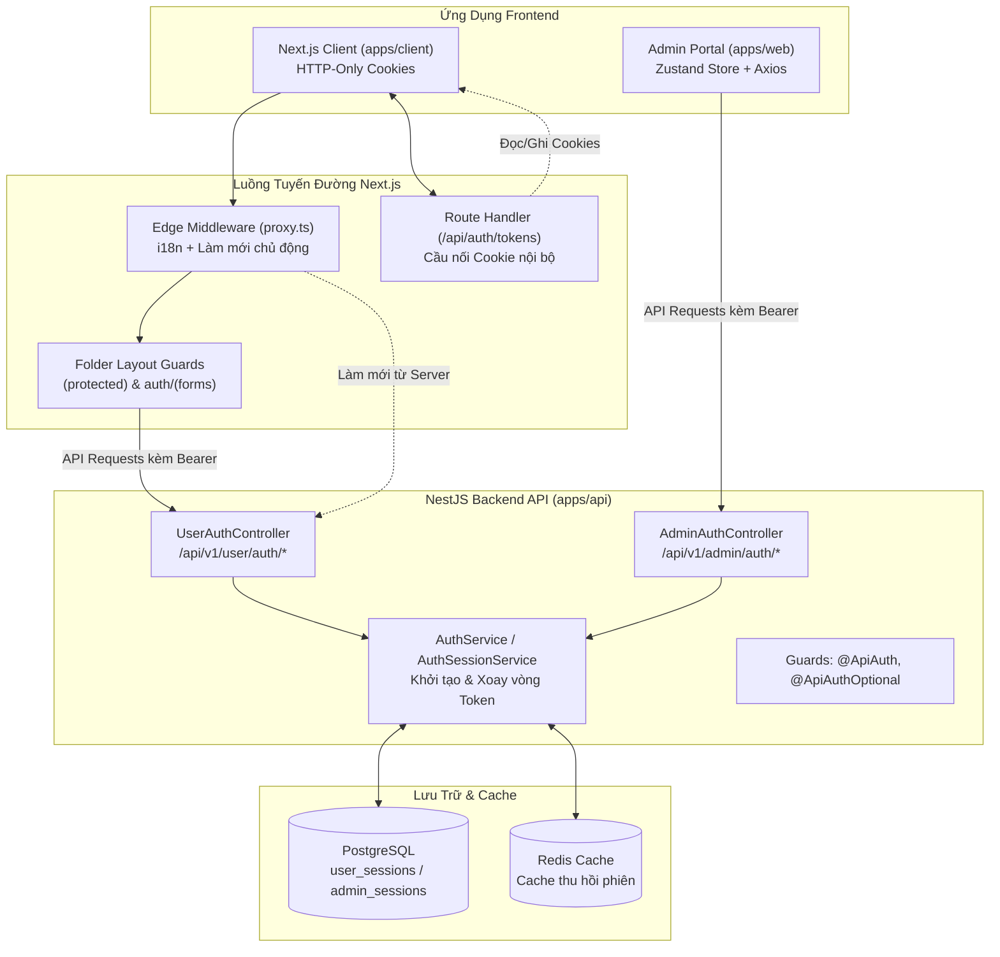

# Hướng Dẫn & Kiến Trúc Xác Thực (Authentication)

> [English](AUTH.md) | **Tiếng Việt**
>
> **Kiến trúc quản lý vòng đời xác thực & phiên làm việc (Session Lifecycle) cấp doanh nghiệp** trên toàn bộ Monorepo (`apps/api`, `apps/client`, `apps/web`), nổi bật với cơ chế Xoay vòng Refresh Token (RTR), Kiểm soát đồng thời Single-Flight, Bảo vệ Route không dùng trick và Xử lý lỗi kiên cường (Resilient Error Handling).

---

## 1. Tổng Quan Kiến Trúc

Monorepo này triển khai kiến trúc xác thực phân tách lớp, bảo mật cao và tối ưu cho các ứng dụng fullstack hiện đại:

1. **Backend (`apps/api`)**: NestJS REST API lưu trữ phiên trong PostgreSQL, TypeORM, Redis cache và Passport JWT strategies hỗ trợ 2 nhóm đối tượng (`user` và `admin`).
2. **Web Client (`apps/client`)**: Ứng dụng Next.js App Router sử dụng HTTP-only cookie, Edge Middleware chủ động gia hạn token, Layout Guards dựa trên thư mục và Client Interceptor cơ chế Single-Flight.
3. **Admin Portal (`apps/web`)**: Ứng dụng SPA Vite + React quản lý trạng thái bằng Zustand kết hợp localStorage, ma trận phân quyền CASL và Axios Interceptor cơ chế Single-Flight.



---

## 2. Các Nguyên Tắc Kiến Trúc Cốt Lõi (Không Dùng Trick)

Kiến trúc xác thực tuân thủ nghiêm ngặt các tiêu chuẩn kỹ thuật phần mềm sạch:

1. **Không Dùng Tham Số Query Tạm Bợ**: Tuyệt đối không dùng các cờ như `?force=true` hoặc các header giả lập như `x-auth-force-login: 1` để can thiệp luồng điều hướng.
2. **Phân Định Trách Nhiệm Rõ Ràng**:
   - **Middleware (`proxy.ts`)**: Chỉ chịu trách nhiệm định tuyến đa ngôn ngữ (`next-intl`), chuyển tiếp header (`x-pathname`) và chủ động làm mới token sắp hết hạn. Middleware **không** nắm danh sách cứng các route riêng tư và **không** cưỡng chế chuyển hướng khách (guest redirect).
   - **Server Component Layouts**: Nhiệm vụ bảo vệ route nằm ở chính cấp layout tương ứng. `(protected)/layout.tsx` bảo vệ các trang riêng tư, trong khi `auth/(forms)/layout.tsx` xử lý chuyển hướng người dùng đã đăng nhập khi truy cập form đăng nhập/đăng ký.
3. **Kiểm Soát Đồng Thời Single-Flight (Promise Deduplication)**: Khi nhiều request bất đồng bộ đồng thời nhận mã lỗi `401 Unauthorized`, chúng sẽ được hợp nhất vào duy nhất 1 request làm mới token gửi lên backend. Điều này ngăn chặn triệt để xung đột Race Condition với cơ chế Xoay vòng Refresh Token (RTR).
4. **Xử Lý Mạng Kiên Cường (Resilient Network Handling)**: Phân định rạch ròi giữa lỗi xác thực thực sự (`401` / `400`) và lỗi hạ tầng mạng tạm thời (`500`, `502`, `503`, `ECONNREFUSED`, timeout). Người dùng **không bao giờ** bị xóa cookie hay bị đá văng khỏi phiên làm việc chỉ vì mạng chập chờn trong chốc lát.
5. **Đa Ngôn Ngữ Tuyệt Đối (i18n)**: Không hardcode bất kỳ chuỗi văn bản thông báo lỗi nào trên giao diện. Toàn bộ thông báo chuyển hướng, nút bấm, tiêu đề cảnh báo đều dùng translation keys từ `next-intl` (`apps/client`) và `react-i18next` (`apps/web`).

---

## 3. Lớp Backend API (`apps/api`)

### 3.1. Đặc Tả Token & Cơ Chế Xoay Vòng (RTR)

- **Access Token**: JWT thời hạn ngắn (mặc định 15 phút), được ký bằng secret riêng cho từng đối tượng (`auth.userSecret` / `auth.secret`).
- **Refresh Token**: JWT thời hạn dài (mặc định 7 ngày), liên kết trực tiếp với bản ghi phiên trong PostgreSQL (`UserSessionEntity` / `AdminSessionEntity`).
- **Refresh Token Rotation (RTR)**: Mỗi lần làm mới thành công, backend cấp 1 access token mới **đồng thời** tạo 1 refresh token mới và vô hiệu hóa hash của token cũ. Nếu phát hiện token cũ được gửi lại, hệ thống nhận diện đây là hành vi tái sử dụng trái phép và lập tức thu hồi toàn bộ phiên.

### 3.2. Guards Endpoint & Đăng Xuất An Toàn

- `@ApiPublic()`: Bỏ qua kiểm tra xác thực đối với các endpoint công khai (login, register, refresh).
- `@ApiAuth()`: Yêu cầu bắt buộc Access Token hợp lệ thông qua Passport JWT strategy.
- `@ApiAuthOptional({ statusCode: 204 })`: Guard xác thực tùy chọn áp dụng cho các endpoint **Logout** (`user-auth.controller.ts` & `admin-auth.controller.ts`).
  - Cho phép thu hồi phiên trong database và dọn sạch cookie ngay cả khi access token của client đã hết hạn từ trước.
  - Phản hồi mã `204 No Content` gọn gàng, không bắn lỗi `401 Unauthorized` unhandled khi người dùng bấm đăng xuất.

### 3.3. Hợp Đồng Kiểm Tra DTO

- **Refresh Request**:
  ```typescript
  export class RefreshReqDto {
    @TokenField()
    refreshToken!: string;
  }
  ```
  Cả hai phía frontend đều gửi payload `{ refreshToken: string }` khớp chuẩn với DTO này.

---

## 4. Lớp Next.js Web Client (`apps/client`)

### 4.1. Cookie & Cầu Nối Token Nội Bộ

Nhằm ngăn chặn lỗ hổng XSS, thông tin xác thực được lưu trong cookie với các thuộc tính `httpOnly`, `sameSite: "lax"` và `secure` trên domain client:

- `accessToken`
- `refreshToken`

Vì JavaScript trình duyệt không thể can thiệp trực tiếp vào `httpOnly` cookie, các BFF Route Handlers đóng vai trò cầu nối nội bộ an toàn tuyệt đối mà không để lộ refresh token ra trình duyệt:

- `GET /api/auth/tokens`: Chỉ trả về duy nhất `{ accessToken }` (Chuẩn Zero-Trust: `refreshToken` không bao giờ bị rò rỉ ra JavaScript trình duyệt).
- `POST /api/auth/tokens`: Thiết lập cookie ban đầu sau khi đăng nhập thành công hoặc hoàn tất OAuth callback.
- `POST /api/auth/refresh`: BFF Route Handler đọc `refreshToken` trực tiếp từ httpOnly cookie, gọi NestJS API làm mới token, xoay vòng cookie và trả về `{ accessToken }` mới.
- `POST /api/auth/logout`: Thu hồi session trên backend NestJS và xóa sạch 2 cookie khi đăng xuất.

### 4.2. Cơ Chế Làm Mới Single-Flight (`apps/client/src/lib/http.ts`)

Để tránh việc các request gửi đồng thời kích hoạt nhiều lệnh làm mới (làm hỏng cơ chế xoay vòng Refresh Token của server), `http.ts` áp dụng pattern **Single-Flight Promise Deduplication** kết nối trực tiếp với route BFF `/api/auth/refresh`:

```typescript
let refreshTokenPromise: Promise<string | null> | null = null;

export async function refreshClientToken(): Promise<string | null> {
  if (refreshTokenPromise) {
    return refreshTokenPromise;
  }

  refreshTokenPromise = (async () => {
    try {
      const res = await xior.post<{ accessToken?: string }>(
        `${process.env.NEXT_PUBLIC_APP_URL}/api/auth/refresh`,
        {},
        { credentials: 'same-origin' },
      );

      const newAccessToken = res.data?.accessToken;
      if (!newAccessToken) return null;

      http.defaults.headers.Authorization = `Bearer ${newAccessToken}`;
      return newAccessToken;
    } catch {
      // Xử lý khi xác thực thất bại: logout và chuyển hướng đăng nhập
      return null;
    } finally {
      refreshTokenPromise = null;
    }
  })();

  return refreshTokenPromise;
}
```

- Khi 5 truy vấn đồng thời nhận lỗi `401`, chỉ duy nhất truy vấn đầu tiên kích hoạt `/api/auth/refresh`.
- 4 truy vấn còn lại cùng chờ kết quả từ `refreshTokenPromise`.
- JavaScript ở trình duyệt hoàn toàn không bao giờ chạm tới hoặc nhận chuỗi `refreshToken` thô.
- Không sử dụng cache biến toàn cục, không dùng event tùy ý trên window, không dùng phép so sánh thời gian cảm tính.

### 4.3. Edge Middleware (`apps/client/src/proxy.ts`)

Middleware của Next.js phụ trách:

1. Định tuyến quốc tế hóa qua `createMiddleware(routing)`.
2. Chuyển tiếp các header `x-pathname` và `x-middleware-*`.
3. Chủ động làm mới token trước khi hết hạn (khi thời gian còn lại `< 1 phút`).

#### Khả Năng Chịu Lỗi (Error Resilience):

- Khi làm mới token trả về `401` hoặc `400` (phiên thực sự hết hạn/không hợp lệ):
  - Xóa cookie `accessToken` và `refreshToken`.
  - Nếu người dùng đang ở trang công khai (`/`) hoặc trang auth (`/auth/login`), không điều hướng cưỡng chế; trang tiếp tục hiển thị bình thường ở trạng thái Khách (Guest).
  - Nếu người dùng đang ở route được bảo vệ, chuyển hướng về `/${locale}/auth/login?code=session_expired&from=${pathname}`.
- Khi gặp sự cố mạng API (backend dừng, timeout, 502/503):
  - Cookie **không** bị xóa, đảm bảo phiên đăng nhập của người dùng không bị mất oan vì trục trặc hạ tầng tạm thời.

### 4.4. Cấu Trúc Bảo Vệ Tuyến Đường (Route Protection Hierarchy)

| Nhóm Tuyến Đường            | Component Phụ Trách | Hành Vi                                                                                                                                                            |
| :-------------------------- | :------------------ | :----------------------------------------------------------------------------------------------------------------------------------------------------------------- |
| `[locale]/(protected)/*`    | `ProtectedLayout`   | Nếu không có phiên hợp lệ, chuyển hướng về `/${locale}/auth/login?code=unauthorized&from=${pathname}`.                                                             |
| `[locale]/auth/(forms)/*`   | `AuthLayout`        | Guest guard. Nếu có `refreshToken` và chưa hết hạn (`exp * 1000 > Date.now()`), chuyển hướng vào `/${locale}/profile`. Ngược lại, hiển thị form đăng nhập sạch sẽ. |
| `[locale]/(public)/*` & `/` | Công khai           | Cho phép mọi người dùng truy cập tự do.                                                                                                                            |

### 4.5. Mã Trạng Thái Chuẩn Hóa (`AUTH_CODE`)

Khai báo tại `apps/client/src/constants/auth.ts`:

- `session_expired`: Phiên làm việc hết hạn hoặc refresh token không còn hợp lệ.
- `unauthorized`: Yêu cầu đăng nhập để truy cập trang được bảo vệ.
- `invalid_token`: Token bị hỏng hoặc payload JWT không hợp lệ.

Form đăng nhập đón nhận các mã này và hiển thị banner cảnh báo thông qua các bản dịch tương ứng (`useTranslations("Auth.login")`).

---

## 5. Lớp Admin Portal (`apps/web`)

### 5.1. Quản Lý Phiên Làm Việc

- Xây dựng trên **Zustand** (`useAuthStore`) kết hợp lưu trữ lâu dài trong localStorage cho `meta.accessToken` và `meta.refreshToken`.
- Request Interceptor tự động gán header `Authorization: Bearer ${accessToken}` đồng bộ từ store.

### 5.2. Làm Mới Token Single-Flight (`apps/web/src/lib/http.ts`)

- Triển khai `refreshAdminToken()` sử dụng chung biến `refreshTokenPromise`.
- Khi gặp lỗi `401`, các request được xếp hàng chờ trong khi tiến trình xoay vòng token diễn ra.
- Sau khi hoàn thành, các request bị hoãn sẽ tự động retry với Bearer token mới.

### 5.3. Xử Lý Khi Mất Kết Nối Server (`ServerOffline`)

- Khi mất kết nối API trong giai đoạn tải quyền hạn, `ProtectedRoutes` sẽ hiển thị màn hình `<ServerOffline />` (tại `pages/errors/server-offline.tsx`).
- Cung cấp 2 lựa chọn: **Thử Lại** (gọi `refetch()`) và **Đăng Xuất** (xóa session và về `/sign-in`).
- Tuân thủ 100% tiêu chuẩn đa ngôn ngữ `react-i18next`.

---

## 6. Lệnh Kiểm Thử & Kiểm Tra Sức Khỏe Toàn Bộ Ứng Dụng

Chạy từ thư mục gốc của repository:

```bash
# Kiểm tra kiểu TypeScript
pnpm --filter api check-types
pnpm --filter client check-types
pnpm --filter web-portal type-check

# Kiểm thử đơn vị & Tích hợp
pnpm --filter api test
pnpm --filter client test
pnpm --filter web-portal test

# Build production
pnpm --filter api build
pnpm --filter client build
pnpm --filter web-portal build
```
