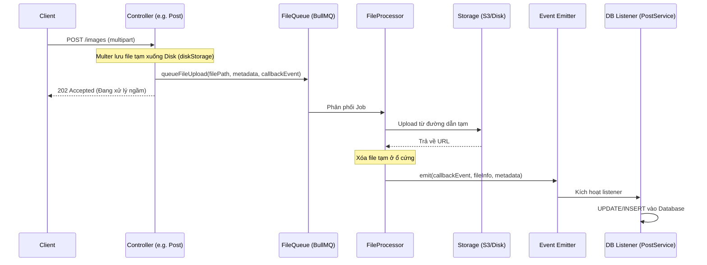

# Background File Upload Architecture

Tài liệu này mô tả kiến trúc xử lý file ngầm (Background File Upload) dùng để giải quyết các bài toán liên quan đến việc upload hàng loạt file cùng lúc (vd: Post Collections, Image Gallery, Batch Import...).

## 1. Vấn đề

Khi client yêu cầu upload 10, 50 hay 100 file ảnh cùng một lúc:

- Nếu gọi hàm upload liên tiếp ở request cycle, Server sẽ bị **quá tải RAM** (vì giữ toàn bộ file trên Buffer), kéo dài thời gian phản hồi API gây ra lỗi **Timeout**.
- Nếu dùng hàng đợi nhưng các Service (vd: Post, Gallery) gọi vòng tới FileModule, kiến trúc sẽ bị **coupled (dính chặt vào nhau)**, rất khó bảo trì.

## 2. Kiến trúc giải quyết

Hệ thống kết hợp **BullMQ** (cho background jobs) và **EventEmitter** (cho mô hình Pub/Sub), giúp decouple hoàn toàn các Module.



## 3. Hướng dẫn sử dụng (HDSD)

Để tích hợp hệ thống upload ngầm vào tính năng mới, bạn thực hiện theo 2 bước sau:

### Bước 1: Tiếp nhận Request và Đẩy vào Queue

Tại Controller, bắt buộc sử dụng **`diskStorage`** để multer lưu file xuống ổ đĩa tạm (không dùng memoryStorage), sau đó dùng `FileQueueService` để xếp hàng (queue).

```typescript
import {
  Controller,
  Post,
  Param,
  UploadedFiles,
  UseInterceptors,
} from '@nestjs/common';
import { FilesInterceptor } from '@nestjs/platform-express';
import { diskStorage } from 'multer';
import { v4 as uuidv4 } from 'uuid';
import { extname } from 'path';
import { FileQueueService } from '@/api/file/file-queue.service';

@Controller('posts')
export class PostController {
  constructor(private readonly fileQueueService: FileQueueService) {}

  @Post(':id/gallery')
  // Cấu hình lưu file tạm xuống thư mục tmp
  @UseInterceptors(
    FilesInterceptor('files', 50, {
      storage: diskStorage({
        destination: '/tmp/uploads',
        filename: (req, file, cb) =>
          cb(null, `${uuidv4()}${extname(file.originalname)}`),
      }),
    }),
  )
  async uploadGallery(
    @Param('id') postId: number,
    @UploadedFiles() files: Express.Multer.File[],
  ) {
    // Duyệt qua file và ném vào Queue
    for (const file of files) {
      await this.fileQueueService.queueFileUpload({
        filePath: file.path,
        originalName: file.originalname,
        mimetype: file.mimetype,
        size: file.size,
        destinationPath: `posts/${postId}/gallery`, // Thư mục lưu trữ đích trên Storage/S3

        // ĐIỂM MẤU CHỐT: Khai báo event sẽ được gọi khi up thành công
        callbackEventName: 'post.gallery.uploaded',

        // Thông tin bạn cần bảo lưu để cập nhật DB sau này
        metadata: { postId },
      });
    }

    return { message: 'Files are being processed in the background.' };
  }
}
```

### Bước 2: Bắt Event và Cập nhật Database

Tại Service của bạn (ví dụ `PostService`), đăng ký listener thông qua decorator `@OnEvent()` bằng đúng tên bạn truyền ở `callbackEventName` phía trên.

```typescript
import { Injectable, Logger } from '@nestjs/common';
import { OnEvent } from '@nestjs/event-emitter';
import { FileEntity } from '@/api/file/entities/file.entity';

@Injectable()
export class PostService {
  private readonly logger = new Logger(PostService.name);

  @OnEvent('post.gallery.uploaded')
  async handleGalleryImageUploaded(payload: {
    jobId: string;
    file: FileEntity;
    metadata: any;
  }) {
    const { postId } = payload.metadata;
    const fileUrl = payload.file.path; // Link sau khi upload xong

    this.logger.log(`Received uploaded image for post ${postId}: ${fileUrl}`);

    // => Thực hiện query lưu URL vào Database tại đây
    // await this.galleryRepo.save({ postId, imageUrl: fileUrl });
  }
}
```

---

**Các lưu ý:**

- Bắt buộc phải có giải pháp dọn dẹp thư mục tạm (`/tmp/uploads`) định kỳ bằng cronjob đề phòng trường hợp node process bị sập bất thình lình, không kịp gọi hàm xóa file tạm ở Queue. Mặc định `FileProcessor` sẽ xóa khi upload thành công.
- Cấu hình số lượng tác vụ chạy song song (concurrency) được thiết lập tại `FileProcessor` trong decorator `@Processor()`. Tùy theo sức chịu tải của Server (CPU/Disk I/O) mà điều chỉnh cho phù hợp.
