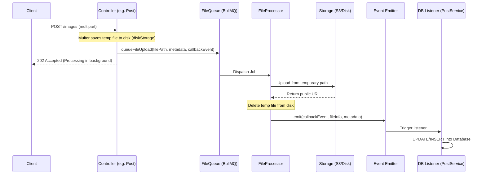

# Background File Upload Architecture

This document describes the background file upload architecture designed to handle bulk file uploads (e.g., Post Collections, Image Galleries, Batch Imports, etc.).

## 1. Problem Statement

When a client needs to upload 10, 50, or 100 images simultaneously:

- Processing uploads synchronously in the HTTP request cycle overloads server RAM (retaining entire files in Buffer) and delays response times, leading to gateway timeouts.
- Tightly coupling domain services (e.g., Post, Gallery) with storage modules makes the codebase brittle and hard to maintain.

## 2. Solution Architecture

The system combines **BullMQ** (for queue-based background processing) and **EventEmitter** (for the Pub/Sub model), completely decoupling the business modules from file processing.


```mermaid
sequenceDiagram
    participant Client
    participant Controller (e.g. Post)
    participant FileQueue (BullMQ)
    participant FileProcessor
    participant Storage (S3/Disk)
    participant Event Emitter
    participant DB Listener (PostService)

    Client->>Controller (e.g. Post): POST /images (multipart)
    Note over Controller (e.g. Post): Multer saves temp file to disk (diskStorage)
    Controller (e.g. Post)->>FileQueue (BullMQ): queueFileUpload(filePath, metadata, callbackEvent)
    Controller (e.g. Post)-->>Client: 202 Accepted (Processing in background)

    FileQueue (BullMQ)->>FileProcessor: Dispatch Job
    FileProcessor->>Storage (S3/Disk): Upload from temporary path
    Storage (S3/Disk)-->>FileProcessor: Return public URL
    Note over FileProcessor: Delete temp file from disk

    FileProcessor->>Event Emitter: emit(callbackEvent, fileInfo, metadata)
    Event Emitter->>DB Listener (PostService): Trigger listener
    DB Listener (PostService)->>DB Listener (PostService): UPDATE/INSERT into Database
```

## 3. Integration Guide

To integrate background file uploading into a new feature, follow these two steps:

### Step 1: Accept the Request and Push to Queue

In your Controller, use **`diskStorage`** with Multer to stream incoming files to temporary disk storage (avoid using `memoryStorage`), then queue the job using `FileQueueService`.

```typescript
import {
  Controller,
  Post,
  Param,
  UploadedFiles,
  UseInterceptors,
} from '@nestjs/common';
import { FilesInterceptor } from '@nestjs/platform-express';
import { diskStorage } from 'multer';
import { v4 as uuidv4 } from 'uuid';
import { extname } from 'path';
import { FileQueueService } from '@/api/file/file-queue.service';

@Controller('posts')
export class PostController {
  constructor(private readonly fileQueueService: FileQueueService) {}

  @Post(':id/gallery')
  @UseInterceptors(
    FilesInterceptor('files', 50, {
      storage: diskStorage({
        destination: '/tmp/uploads',
        filename: (req, file, cb) =>
          cb(null, `${uuidv4()}${extname(file.originalname)}`),
      }),
    }),
  )
  async uploadGallery(
    @Param('id') postId: number,
    @UploadedFiles() files: Express.Multer.File[],
  ) {
    for (const file of files) {
      await this.fileQueueService.queueFileUpload({
        filePath: file.path,
        originalName: file.originalname,
        mimetype: file.mimetype,
        size: file.size,
        destinationPath: `posts/${postId}/gallery`, // Destination folder on Storage/S3

        // Key point: specify the event emitted on successful upload
        callbackEventName: 'post.gallery.uploaded',

        // Metadata needed to persist or associate in the database later
        metadata: { postId },
      });
    }

    return { message: 'Files are being processed in the background.' };
  }
}
```

### Step 2: Listen to the Event and Update Database

In your domain service (e.g., `PostService`), register an `@OnEvent()` listener matching the `callbackEventName` provided above.

```typescript
import { Injectable, Logger } from '@nestjs/common';
import { OnEvent } from '@nestjs/event-emitter';
import { FileEntity } from '@/api/file/entities/file.entity';

@Injectable()
export class PostService {
  private readonly logger = new Logger(PostService.name);

  @OnEvent('post.gallery.uploaded')
  async handleGalleryImageUploaded(payload: {
    jobId: string;
    file: FileEntity;
    metadata: any;
  }) {
    const { postId } = payload.metadata;
    const fileUrl = payload.file.path; // URL after upload completes

    this.logger.log(`Received uploaded image for post ${postId}: ${fileUrl}`);

    // Persist URL/record in Database here:
    // await this.galleryRepo.save({ postId, imageUrl: fileUrl });
  }
}
```

---

## 4. Operational Considerations

- Ensure a periodic cleanup cronjob is configured for temporary upload directories (`/tmp/uploads`) in case a process terminates unexpectedly before `FileProcessor` can delete the temporary file. Under normal conditions, `FileProcessor` automatically cleans up temporary files upon job completion.
- Concurrency for file processing is configured via the `@Processor()` decorator in `FileProcessor`. Adjust concurrency according to server capacity (CPU/Disk I/O).
