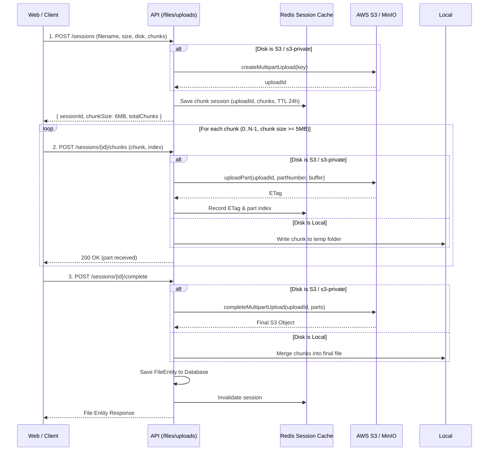

# Filesystem & Storage Architecture

> **English** | [Tiếng Việt](filesystem.vi.md)

This document describes the unified Filesystem architecture implemented in the Monorepo. Inspired by **Laravel's Storage System (`Storage::disk()`)**, it provides a driver-based abstraction for managing files across local storage, local public assets, AWS S3, and MinIO.

---

## 1. Architecture Overview

The system abstracts storage operations behind the `FilesystemService` and a common `StorageDriver` interface. Business domains never interact directly with raw file paths or S3 SDK clients; instead, they operate through disk definitions.

```
                           +----------------------+
                           |  FilesystemService   |
                           +----------+-----------+
                                      |
         +----------------------------+----------------------------+
         |                            |                            |
+--------v-------+           +--------v-------+           +--------v-------+
|  LocalDriver   |           |  PublicDriver  |           |    S3Driver    |
| (Private Disk) |           | (Public Disk)  |           | (AWS S3/MinIO) |
+--------+-------+           +--------+-------+           +--------+-------+
         |                            |                            |
  storage/app/private           storage/public           Public / Private Bucket
  (Auth session required)      (Direct HTTP URL)       (Direct CDN or Signed URL)
```

### Configured Disks

| Disk Name    | Visibility | Driver          | Target Destination                                 | Default Access Mechanism                                                    |
| ------------ | ---------- | --------------- | -------------------------------------------------- | --------------------------------------------------------------------------- |
| `public`     | `public`   | Local / Public  | `storage/public`                                   | Direct URL `/storage/uploads/...`                                           |
| `local`      | `private`  | Local / Private | `storage/app/private`                              | Authenticated stream route `/api/v1/files/stream/...`                       |
| `s3`         | `public`   | S3 / MinIO      | `AWS_BUCKET` (e.g. `nest-uploads`)                 | Direct S3 / CDN URL (`AWS_URL` or `AWS_ENDPOINT/bucket/...`)                |
| `s3-private` | `private`  | S3 / MinIO      | `AWS_PRIVATE_BUCKET` (e.g. `nest-uploads-private`) | Presigned Temporary URL (`temporaryUrl(path, ttl)`) or Authenticated Stream |

> [!NOTE]
> The active default disk is defined by `FILESYSTEM_DISK` in environment variables. Calling `this.storage.disk()` without parameters automatically resolves to the default disk.

---

## 2. Driver Capabilities & Methods

All drivers implement `StorageDriver`:

```typescript
export interface StorageDriver {
  put(
    path: string,
    content: Buffer | Uint8Array | string | Readable,
    options?: PutOptions,
  ): Promise<void>;
  get(path: string): Promise<Buffer>;
  readStream(path: string): Promise<Readable>;
  delete(path: string): Promise<boolean>;
  deleteDirectory(prefix: string): Promise<boolean>;
  exists(path: string): Promise<boolean>;
  size(path: string): Promise<number>;
  mimeType(path: string): Promise<string | null>;
  lastModified(path: string): Promise<Date>;
  url(path: string): string;
  temporaryUrl?(path: string, expiresInSeconds: number): Promise<string>;
  copy(source: string, destination: string): Promise<void>;
  move(source: string, destination: string): Promise<void>;
}
```

### Multipart Uploads (`MultipartCapable`)

For large files, `S3Driver` implements `MultipartCapable` using AWS S3 native Multipart Upload APIs (`CreateMultipartUploadCommand`, `UploadPartCommand`, `CompleteMultipartUploadCommand`, `AbortMultipartUploadCommand`).

This allows chunk uploads to stream directly from the client to AWS S3 / MinIO without buffering or storing gigabytes of temporary chunk files on the application server.

---

## 3. Usage Guidelines

### 3.1. Dependency Injection in NestJS

#### Option A: Injecting the Filesystem Service (Recommended)

```typescript
import { Injectable } from '@nestjs/common';
import { FilesystemService } from '@/filesystem/filesystem.service';

@Injectable()
export class AssetService {
  constructor(private readonly storage: FilesystemService) {}

  async savePublicImage(path: string, buffer: Buffer, mimeType: string) {
    // Uses the system default configured disk (e.g. 's3' or 'public')
    await this.storage
      .disk()
      .put(path, buffer, { mimeType, visibility: 'public' });
    return this.storage.disk().url(path);
  }

  async saveSecureDocument(path: string, buffer: Buffer) {
    // Explicitly target a private disk
    const disk = this.storage.hasDisk('s3-private') ? 's3-private' : 'local';
    await this.storage.disk(disk).put(path, buffer, { visibility: 'private' });

    // Generate 15-minute presigned download URL
    return this.storage.disk(disk).temporaryUrl(path, 900);
  }
}
```

#### Option B: Injecting a Specific Disk Directly

```typescript
import { Injectable } from '@nestjs/common';
import { InjectDisk } from '@/filesystem/decorators/inject-disk.decorator';
import type { StorageDriver } from '@/filesystem/drivers/storage-driver.interface';

@Injectable()
export class InvoiceService {
  constructor(
    @InjectDisk('s3-private') private readonly secureStorage: StorageDriver,
  ) {}

  async generateSignedDownloadUrl(filename: string) {
    return this.secureStorage.temporaryUrl(`invoices/${filename}`, 3600);
  }
}
```

---

## 4. File Upload Workflows

### 4.1. Single File Upload (e.g. Website Settings, Profile Avatars)

- In Controllers, use Multer with **`memoryStorage()`** (or `@UploadFile()`).
- Store the buffer via `this.storage.disk().put(path, file.buffer)`.
- Retrieve public URLs via `this.storage.disk().url(path)`.
- Old/replaced assets are cleaned up via `this.storage.disk().delete(oldPath)`.

### 4.2. Chunked Large File Upload (`/api/v1/files/uploads/*`)

For files up to 500MB (video, raw documents):



> [!IMPORTANT]
> **AWS S3 Requirement**: Every multipart upload part (except the last part) must be at least **5 MB** in size (`5242880 bytes`).
> The frontend and backend are configured with `FILE_UPLOAD_CHUNK_SIZE = 6 * 1024 * 1024` (6MB) to ensure compliance.

### 4.3. Background Bulk Upload (Queue + Events)

For bulk imports (10+ images at once), refer to [docs/BACKGROUND_FILE_UPLOAD.md](file:///docs/BACKGROUND_FILE_UPLOAD.md) which routes files through **BullMQ** and emits domain events.

---

## 5. Local Development with MinIO

Development environment uses **MinIO** to provide 100% S3-compatible object storage locally.

### Starting MinIO Infrastructure

You can start MinIO individually or via the full setup script:

```bash
# Start MinIO server and auto-initialize buckets only:
pnpm run minio
# or:
pnpm run setup --minio

# Or run the interactive setup wizard and choose option 5:
pnpm run setup
```

Docker Compose spins up:

1. `minio`: S3 API on port `9000`, MinIO Console on port `9001`.
2. `minio-init`: A lightweight MinIO Client (`mc`) container that runs once on startup to:
   - Create public bucket `nest-uploads` with anonymous download permissions enabled.
   - Create private bucket `nest-uploads-private`.

### Environment Configuration (`apps/api/.env`)

```env
FILESYSTEM_DISK=public
FILESYSTEM_LOCAL_ROOT=storage

# MinIO Local S3 Configuration
AWS_ACCESS_KEY_ID=minioadmin
AWS_SECRET_ACCESS_KEY=minioadmin
AWS_REGION=us-east-1
AWS_BUCKET=nest-uploads
AWS_PRIVATE_BUCKET=nest-uploads-private
AWS_ENDPOINT=http://localhost:9000
AWS_URL=http://localhost:9000/nest-uploads
AWS_USE_PATH_STYLE_ENDPOINT=true
MINIO_PORT=9000
MINIO_CONSOLE_PORT=9001
```

To switch local development to store files in MinIO instead of local disk, simply set:

```env
FILESYSTEM_DISK=s3
```

---

## 6. Production Migration to AWS S3

To migrate the production environment entirely to AWS:

### Step 1: Create AWS S3 Buckets

1. **Public Bucket** (e.g. `visel-media-public`):
   - Configure public access or point a CloudFront distribution to it.
   - Configure CORS rules allowing `PUT`, `POST`, `GET`, `DELETE` from your web portal domain.
2. **Private Bucket** (e.g. `visel-media-private`):
   - Block all public access.
   - Accessible only through IAM user / role credentials.

### Step 2: Configure Production Environment (`apps/api/.env`)

```env
FILESYSTEM_DISK=s3
FILESYSTEM_LOCAL_ROOT=storage

AWS_ACCESS_KEY_ID=AKIA...
AWS_SECRET_ACCESS_KEY=wJalr...
AWS_REGION=ap-southeast-1
AWS_BUCKET=visel-media-public
AWS_PRIVATE_BUCKET=visel-media-private
AWS_URL=https://cdn.example.com
AWS_ENDPOINT=
AWS_USE_PATH_STYLE_ENDPOINT=false
```

### Step 3: Run Database & Health Check

- Existing files previously stored under `local` or `public` disk remain accessible through their recorded URLs in `files.url`.
- Newly uploaded files will default to S3 and take full advantage of CloudFront CDN delivery and S3 multipart uploading.
