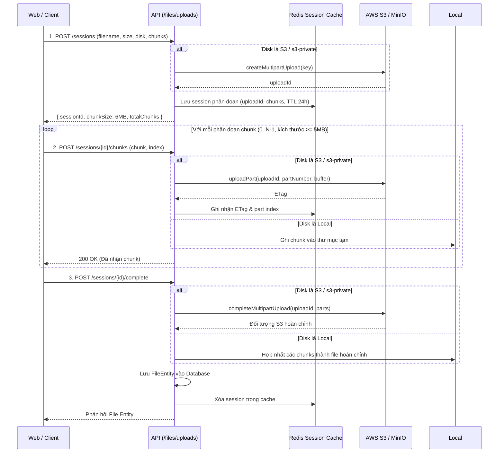

# Kiến Trúc Quản Lý Tệp & Lưu Trữ (Filesystem Architecture)

> [English](filesystem.md) | **Tiếng Việt**

Tài liệu này mô tả kiến trúc Filesystem thống nhất được triển khai trong Monorepo. Lấy cảm hứng từ **Hệ thống Storage của Laravel (`Storage::disk()`)**, kiến trúc cung cấp một lớp trừu tượng dựa trên Driver để quản lý tệp tin linh hoạt giữa lưu trữ cục bộ (local storage), tệp tĩnh công khai cục bộ (public disk), AWS S3 và MinIO.

---

## 1. Tổng Quan Kiến Trúc

Hệ thống trừu tượng hóa các tác vụ lưu trữ thông qua `FilesystemService` và giao diện chung `StorageDriver`. Các domain nghiệp vụ không bao giờ tương tác trực tiếp với đường dẫn file thô hay SDK client của S3; thay vào đó, các thao tác luôn được thực hiện qua các định nghĩa Disk.

```
                           +----------------------+
                           |  FilesystemService   |
                           +----------+-----------+
                                      |
         +----------------------------+----------------------------+
         |                            |                            |
+--------v-------+           +--------v-------+           +--------v-------+
|  LocalDriver   |           |  PublicDriver  |           |    S3Driver    |
| (Private Disk) |           | (Public Disk)  |           | (AWS S3/MinIO) |
+--------+-------+           +--------+-------+           +--------+-------+
         |                            |                            |
  storage/app/private           storage/public           Public / Private Bucket
(Yêu cầu session xác thực)    (Truy cập trực tiếp URL)   (Trực tiếp CDN hoặc Signed URL)
```

### Danh Sách Các Ổ Đĩa (Disks) Được Cấu Hình

| Tên Disk     | Phạm Vi   | Driver          | Đích Lưu Trữ                                         | Cơ Chế Truy Cập Mặc Định                                                     |
| ------------ | --------- | --------------- | ---------------------------------------------------- | ---------------------------------------------------------------------------- |
| `public`     | `public`  | Local / Public  | `storage/public`                                     | URL trực tiếp `/storage/uploads/...`                                         |
| `local`      | `private` | Local / Private | `storage/app/private`                                | Route stream có xác thực `/api/v1/files/stream/...`                          |
| `s3`         | `public`  | S3 / MinIO      | `AWS_BUCKET` (ví dụ: `nest-uploads`)                 | URL trực tiếp S3 / CDN (`AWS_URL` hoặc `AWS_ENDPOINT/bucket/...`)            |
| `s3-private` | `private` | S3 / MinIO      | `AWS_PRIVATE_BUCKET` (ví dụ: `nest-uploads-private`) | URL tạm thời có chữ ký (`temporaryUrl(path, ttl)`) hoặc Authenticated Stream |

> [!NOTE]
> Disk mặc định hoạt động được định nghĩa bởi biến môi trường `FILESYSTEM_DISK`. Gọi `this.storage.disk()` không tham số sẽ tự động phân giải về disk mặc định này.

---

## 2. Năng Lực & Phương Thức Của Driver

Tất cả các driver đều triển khai interface `StorageDriver`:

```typescript
export interface StorageDriver {
  put(
    path: string,
    content: Buffer | Uint8Array | string | Readable,
    options?: PutOptions,
  ): Promise<void>;
  get(path: string): Promise<Buffer>;
  readStream(path: string): Promise<Readable>;
  delete(path: string): Promise<boolean>;
  deleteDirectory(prefix: string): Promise<boolean>;
  exists(path: string): Promise<boolean>;
  size(path: string): Promise<number>;
  mimeType(path: string): Promise<string | null>;
  lastModified(path: string): Promise<Date>;
  url(path: string): string;
  temporaryUrl?(path: string, expiresInSeconds: number): Promise<string>;
  copy(source: string, destination: string): Promise<void>;
  move(source: string, destination: string): Promise<void>;
}
```

### Tải Lên Phân Đoạn (`MultipartCapable`)

Đối với tệp lớn, `S3Driver` triển khai `MultipartCapable` sử dụng các API Multipart Upload gốc của AWS S3 (`CreateMultipartUploadCommand`, `UploadPartCommand`, `CompleteMultipartUploadCommand`, `AbortMultipartUploadCommand`).

Cơ chế này cho phép các phân đoạn (chunks) được stream trực tiếp từ client lên AWS S3 / MinIO mà không cần lưu đệm hàng gigabyte tệp tạm trên server ứng dụng.

---

## 3. Hướng Dẫn Sử Dụng

### 3.1. Dependency Injection trong NestJS

#### Cách A: Inject FilesystemService (Khuyến Nghị)

```typescript
import { Injectable } from '@nestjs/common';
import { FilesystemService } from '@/filesystem/filesystem.service';

@Injectable()
export class AssetService {
  constructor(private readonly storage: FilesystemService) {}

  async savePublicImage(path: string, buffer: Buffer, mimeType: string) {
    // Sử dụng disk mặc định của hệ thống (ví dụ: 's3' hoặc 'public')
    await this.storage
      .disk()
      .put(path, buffer, { mimeType, visibility: 'public' });
    return this.storage.disk().url(path);
  }

  async saveSecureDocument(path: string, buffer: Buffer) {
    // Chỉ định rõ ràng lưu vào disk riêng tư (private)
    const disk = this.storage.hasDisk('s3-private') ? 's3-private' : 'local';
    await this.storage.disk(disk).put(path, buffer, { visibility: 'private' });

    // Tạo URL tải xuống có chữ ký hết hạn sau 15 phút (900 giây)
    return this.storage.disk(disk).temporaryUrl(path, 900);
  }
}
```

#### Cách B: Inject Trực Tiếp Một Disk Cụ Thể

```typescript
import { Injectable } from '@nestjs/common';
import { InjectDisk } from '@/filesystem/decorators/inject-disk.decorator';
import type { StorageDriver } from '@/filesystem/drivers/storage-driver.interface';

@Injectable()
export class InvoiceService {
  constructor(
    @InjectDisk('s3-private') private readonly secureStorage: StorageDriver,
  ) {}

  async generateSignedDownloadUrl(filename: string) {
    return this.secureStorage.temporaryUrl(`invoices/${filename}`, 3600);
  }
}
```

---

## 4. Các Luồng Xử Lý Tải Tệp (Upload Workflows)

### 4.1. Tải Lên Tệp Đơn (Ví dụ: Cài đặt website, Avatar cá nhân)

- Trong Controller, sử dụng Multer với **`memoryStorage()`** (hoặc `@UploadFile()`).
- Lưu trữ buffer qua `this.storage.disk().put(path, file.buffer)`.
- Lấy public URL qua `this.storage.disk().url(path)`.
- Dọn dẹp tài nguyên cũ qua `this.storage.disk().delete(oldPath)`.

### 4.2. Tải Lên Tệp Lớn Theo Phân Đoạn Chunk (`/api/v1/files/uploads/*`)

Dành cho các tệp dung lượng lên đến 500MB (video, tài liệu lớn):



> [!IMPORTANT]
> **Yêu cầu kỹ thuật từ AWS S3**: Mỗi phân đoạn tải lên multipart (ngoại trừ phân đoạn cuối cùng) bắt buộc phải có dung lượng tối thiểu **5 MB** (`5242880 bytes`).
> Phía frontend và backend được cấu hình với `FILE_UPLOAD_CHUNK_SIZE = 6 * 1024 * 1024` (6MB) để đảm bảo tuân thủ tiêu chuẩn này.

### 4.3. Tải Lên Hàng Loạt Chạy Ngầm (Queue + Events)

Với các tác vụ tải lên hàng loạt (10+ hình ảnh cùng lúc), hãy xem [docs/BACKGROUND_FILE_UPLOAD.vi.md](./BACKGROUND_FILE_UPLOAD.vi.md) để điều phối tệp qua **BullMQ** và phát sự kiện nghiệp vụ.

---

## 5. Môi Trường Phát Triển Cục Bộ Với MinIO

Môi trường phát triển cục bộ sử dụng **MinIO** tương thích 100% với chuẩn AWS S3.

### Khởi Chạy Hạ Tầng MinIO

Bạn có thể khởi động riêng MinIO hoặc qua lệnh cài đặt đầy đủ:

```bash
# Khởi động máy chủ MinIO và tự động tạo buckets:
pnpm run minio
# hoặc:
pnpm run setup --minio

# Hoặc chạy wizard cài đặt tương tác và chọn tùy chọn 5:
pnpm run setup
```

Docker Compose sẽ chạy:

1. `minio`: S3 API ở cổng `9000`, MinIO Console giao diện ở cổng `9001`.
2. `minio-init`: Container MinIO Client (`mc`) gọn nhẹ chạy một lần khi khởi động để:
   - Tạo bucket công khai `nest-uploads` kèm quyền tải công khai cho khách.
   - Tạo bucket riêng tư `nest-uploads-private`.

### Cấu Hình Biến Môi Trường (`apps/api/.env`)

```env
FILESYSTEM_DISK=public
FILESYSTEM_LOCAL_ROOT=storage

# MinIO Local S3 Configuration
AWS_ACCESS_KEY_ID=minioadmin
AWS_SECRET_ACCESS_KEY=minioadmin
AWS_REGION=us-east-1
AWS_BUCKET=nest-uploads
AWS_PRIVATE_BUCKET=nest-uploads-private
AWS_ENDPOINT=http://localhost:9000
AWS_URL=http://localhost:9000/nest-uploads
AWS_USE_PATH_STYLE_ENDPOINT=true
MINIO_PORT=9000
MINIO_CONSOLE_PORT=9001
```

Để chuyển phát triển cục bộ sang lưu trữ trên MinIO thay vì ổ đĩa local, chỉ cần đổi:

```env
FILESYSTEM_DISK=s3
```

---

## 6. Chuyển Đổi Lên AWS S3 Môi Trường Production

Để di chuyển toàn bộ lưu trữ sang AWS S3 cho môi trường Production:

### Bước 1: Tạo Các Bucket Trên AWS S3

1. **Bucket Công Khai** (ví dụ: `visel-media-public`):
   - Cấu hình public access hoặc trỏ CloudFront CDN phân phối tới bucket này.
   - Cấu hình quy tắc CORS cho phép `PUT`, `POST`, `GET`, `DELETE` từ domain của trang admin portal.
2. **Bucket Riêng Tư** (ví dụ: `visel-media-private`):
   - Chặn toàn bộ truy cập công khai.
   - Chỉ cho phép truy cập qua thông tin xác thực IAM user / role.

### Bước 2: Cấu Hình Biến Môi Trường Production (`apps/api/.env`)

```env
FILESYSTEM_DISK=s3
FILESYSTEM_LOCAL_ROOT=storage

AWS_ACCESS_KEY_ID=AKIA...
AWS_SECRET_ACCESS_KEY=wJalr...
AWS_REGION=ap-southeast-1
AWS_BUCKET=visel-media-public
AWS_PRIVATE_BUCKET=visel-media-private
AWS_URL=https://cdn.example.com
AWS_ENDPOINT=
AWS_USE_PATH_STYLE_ENDPOINT=false
```

### Bước 3: Kiểm Tra Cơ Sở Dữ Liệu & Kiểm Tra Sức Khỏe

- Các tệp đã lưu trước đó trong disk `local` hoặc `public` vẫn truy cập bình thường qua URL đã ghi trong `files.url`.
- Các tệp tải lên mới sẽ mặc định lưu trên S3, tận dụng tốc độ phân phối của CloudFront CDN và tính năng tải lên phân đoạn AWS S3 Multipart.
