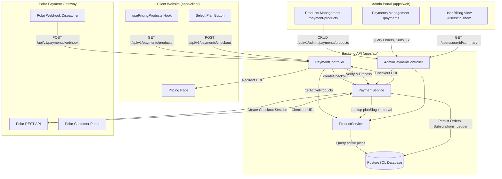
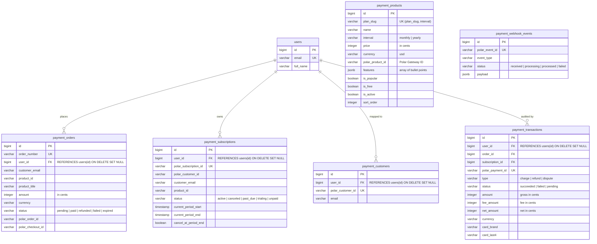
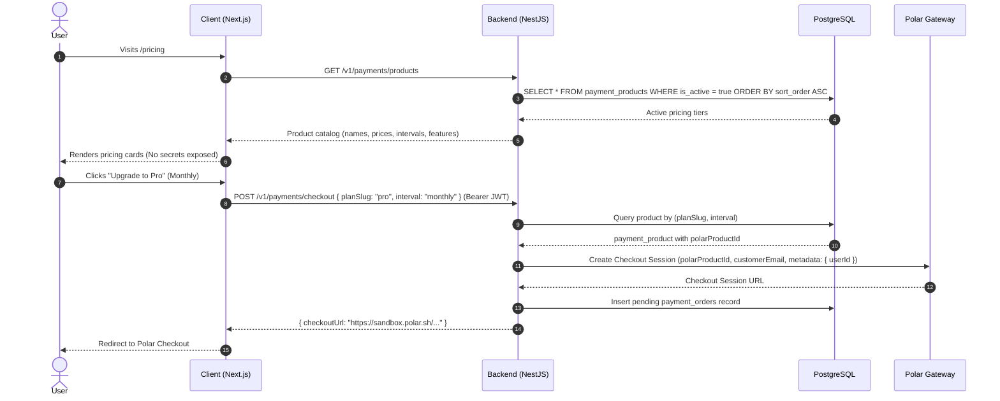
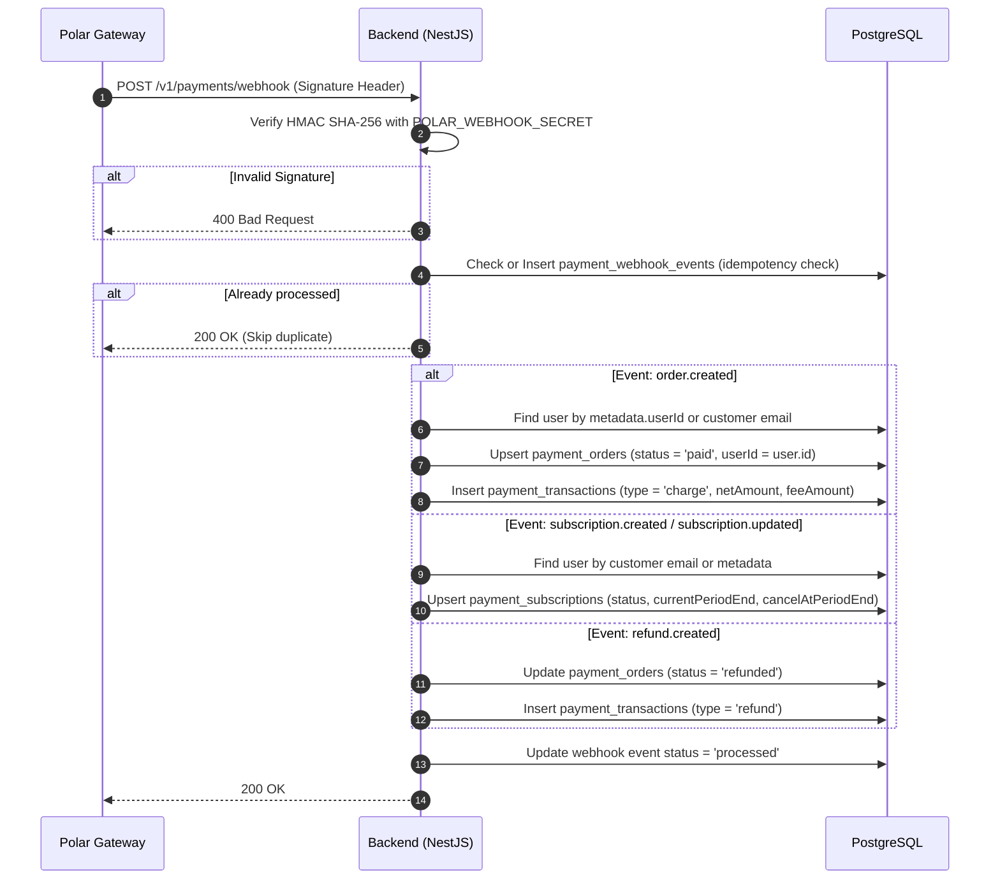

# Payment Architecture & Implementation Guide

This document details the end-to-end architecture, database schema, API workflows, security, and administrative management for the Payment Module integrated with **Polar.sh**.

---

## 1. Architectural Principles & Overview

The payment system follows a **Backend-Driven Architecture** with strict security and isolation guarantees:

1. **Zero Client Secrets**:
   - The frontend (`apps/client`) holds **no** payment provider credentials, webhook secrets, or Polar Product IDs.
   - All pricing tiers, plan metadata, and Polar gateway product IDs are stored and served dynamically from the backend database (`payment_products`).
2. **Catalog-Driven Checkout**:
   - The client application interacts solely using human-readable slugs and billing frequencies: `{ planSlug: 'pro', interval: 'monthly' }`.
   - The backend resolves the corresponding Polar Product ID and handles checkout generation.
3. **Modular Service Separation**:
   - [`ProductService`](file:///apps/api/src/api/payment/services/product.service.ts): Manages plan definitions, tier pricing, feature lists, and Polar Product ID mapping.
   - [`PaymentService`](file:///apps/api/src/api/payment/services/payment.service.ts): Handles checkout orchestration, webhook ingestion, subscription state machines, ledger transactions, and user billing summaries.
4. **Relational Data Integrity**:
   - All payment entities (`payment_orders`, `payment_subscriptions`, `payment_customers`, `payment_transactions`) are strictly linked to the core [`users`](file:///apps/api/src/api/user/entities/user.entity.ts) table via TypeORM `@ManyToOne` foreign keys with `ON DELETE SET NULL`.
5. **Idempotent Webhooks**:
   - Every incoming Polar webhook event is verified via HMAC SHA-256 and tracked in `payment_webhook_events` to prevent duplicate processing.
6. **Extensible Gateway Strategy Pattern (`IPaymentGateway`)**:
   - All gateway-specific communications are encapsulated in dedicated providers implementing [`IPaymentGateway`](file:///apps/api/src/api/payment/interfaces/payment-gateway.interface.ts).
   - Currently powered by [`PolarProvider`](file:///apps/api/src/api/payment/providers/polar.provider.ts) and orchestrated by [`PaymentGatewayFactory`](file:///apps/api/src/api/payment/factories/payment-gateway.factory.ts).
   - Allows seamless plug-and-play addition of future gateways (e.g., VNPAY, MoMo, Stripe) without database schema modifications.

---

## 2. High-Level System Architecture



---

## 3. Database Schema & Data Models

### 3.1. Entity Relationship Diagram



### 3.2. Migration History

1. `1780192650000-create-payment-tables.ts`: Creates baseline tables (`payment_customers`, `payment_orders`, `payment_subscriptions`, `payment_transactions`, `payment_webhook_events`).
2. `1780192750000-create-payment-products-table.ts`: Creates `payment_products` catalog table and seeds default tier plans (`starter`, `pro`, `enterprise`).
3. `1780192850000-link-users-to-payment-tables.ts`: Converts `user_id` columns to `bigint` and creates Foreign Key constraints referencing `users(id)` with `ON DELETE SET NULL ON UPDATE NO ACTION`.

---

## 4. Key Workflows

### 4.1. Dynamic Pricing Display & Checkout Flow



### 4.2. Webhook Ingestion & Fulfillment Flow



### 4.3. Customer Self-Service Portal Flow

Authenticated users can manage their payment methods, view invoices, or cancel subscriptions without contacting support:

1. User clicks **Manage Subscription** on Client portal.
2. Client requests `GET /api/v1/payments/customer-portal` with JWT.
3. Backend looks up user's Polar Customer ID from `payment_customers` (or resolves via email).
4. Backend calls Polar API to generate an authenticated Customer Portal session.
5. Client opens the Polar Customer Portal URL in a secure new tab.

---

## 5. Admin Portal Management (`apps/web`)

The Admin Portal provides full operational visibility and configuration controls for billing and payments:

### 5.1. Global Payment Management (`/payments`)

Accessible via the sidebar navigation under **Management -> Payments**:

- **Orders Tab** ([`orders-tab.tsx`](file:///apps/web/src/pages/payments/components/orders-tab.tsx)):
  - Real-time search across order number, customer email, and Polar order ID.
  - Status badges (`PAID`, `PENDING`, `REFUNDED`, `FAILED`, `EXPIRED`).
  - Direct links to associated user profiles (`User #ID`).
- **Subscriptions Tab** ([`subscriptions-tab.tsx`](file:///apps/web/src/pages/payments/components/subscriptions-tab.tsx)):
  - Monitoring of recurring SaaS subscriptions.
  - Active/Cancelled status indicators.
  - Renewal tracking (`Period End` and `Auto Renew` status).
- **Transactions Tab** ([`transactions-tab.tsx`](file:///apps/web/src/pages/payments/components/transactions-tab.tsx)):
  - Financial ledger auditing.
  - Breakdowns for Gross Amount, Platform Fee, and Net Settlement Amount.
  - Card brand and last 4 digits tracking.

### 5.2. Payment Products & Pricing Tier Manager (`/payment-products`)

Accessible under **Management -> Payment Products**:

- Add, update, or deprecate pricing plans dynamically.
- Modify Polar Product IDs for production or sandbox without redeploying code.
- Customize features list (JSON/array), promotional badges (`Popular`, `Free`), and call-to-action text.

### 5.3. User-Specific Payment Audit (`/users/:id/show`)

Integrated into the User Detail view ([`UserPaymentCard`](file:///apps/web/src/pages/users/show/components/user-payment-card.tsx)):

- **Lifetime Value (LTV)**: Total amount spent by the user across all completed orders.
- **Total Orders**: Count of successful purchases.
- **Active Subscription Status**: Summary of the user's active plan, expiry date, and cancellation schedule.
- **History Tables**: Direct view of all subscriptions and recent orders associated with the specific user account.

---

## 6. API Reference

### 6.1. Public / Client Endpoints (`/api/v1/payments`)

| Method | Endpoint            | Auth                       | Description                                                    |
| :----- | :------------------ | :------------------------- | :------------------------------------------------------------- |
| `GET`  | `/products`         | None                       | Retrieves all active pricing products for public pricing table |
| `POST` | `/checkout`         | Optional (JWT recommended) | Initiates checkout session by `planSlug` and `interval`        |
| `POST` | `/webhook`          | Webhook Signature          | Ingests Polar webhook events with idempotency                  |
| `GET`  | `/customer-portal`  | User JWT                   | Generates Polar customer self-service portal link              |
| `GET`  | `/my-orders`        | User JWT                   | Returns payment orders for current authenticated user          |
| `GET`  | `/my-subscriptions` | User JWT                   | Returns subscriptions for current authenticated user           |

### 6.2. Admin Endpoints (`/api/v1/admin/payments`)

| Method   | Endpoint                 | Auth      | Description                                                 |
| :------- | :----------------------- | :-------- | :---------------------------------------------------------- |
| `GET`    | `/orders`                | Admin JWT | Paginated list of all customer orders                       |
| `GET`    | `/subscriptions`         | Admin JWT | Paginated list of all SaaS subscriptions                    |
| `GET`    | `/transactions`          | Admin JWT | Paginated list of financial ledger transactions             |
| `GET`    | `/users/:userId/summary` | Admin JWT | Summary of LTV, active plan, and orders for a specific user |
| `GET`    | `/products`              | Admin JWT | Paginated list of payment products/tiers                    |
| `GET`    | `/products/:id`          | Admin JWT | Get product configuration by ID                             |
| `POST`   | `/products`              | Admin JWT | Create a new pricing tier / Polar product mapping           |
| `PUT`    | `/products/:id`          | Admin JWT | Update pricing tier or Polar product ID                     |
| `DELETE` | `/products/:id`          | Admin JWT | Soft/Hard remove a pricing tier                             |

---

## 7. Environment Variables

### Backend (`apps/api/.env`)

```env
# Polar Gateway Credentials
POLAR_ACCESS_TOKEN=polar_at_your_access_token_here
POLAR_ORGANIZATION_ID=your-organization-id
POLAR_WEBHOOK_SECRET=your_webhook_secret_here
POLAR_SERVER=sandbox # 'sandbox' for staging/dev, 'production' for live
```

### Client (`apps/client/.env`)

> [!NOTE]
> Client applications **no longer require** any `NEXT_PUBLIC_POLAR_PRODUCT_*` variables. Pricing is resolved automatically via backend API.

---

## 8. Development & Verification Guide

### 8.1. Running Type Checks & Unit Tests

```bash
# Check TypeScript across backend and admin portal
pnpm --filter api check-types
pnpm --filter web-portal check-types

# Run Payment Module Unit Tests
pnpm --filter api test -- payment
```

### 8.2. Verifying Database Schema Synchronization

Verify that TypeORM entities match PostgreSQL schema with zero diff:

```bash
pnpm --filter api migration:generate src/database/migrations/VerifySync
```

_(Should output: `No changes in database schema were found`)_
