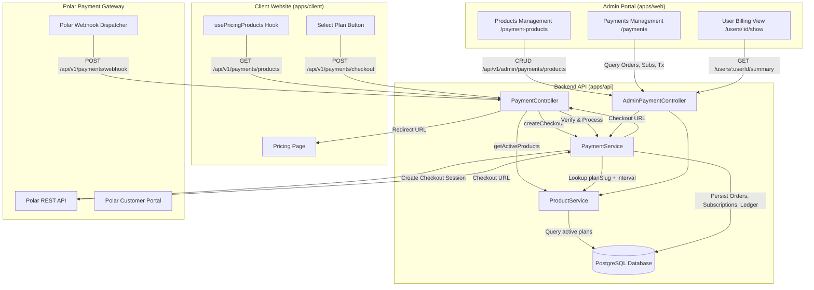
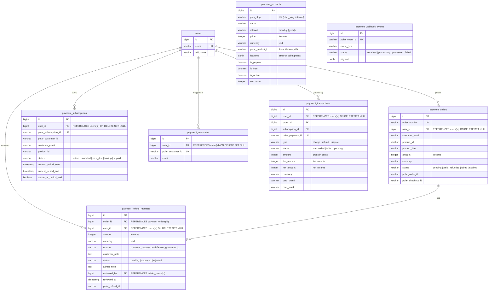
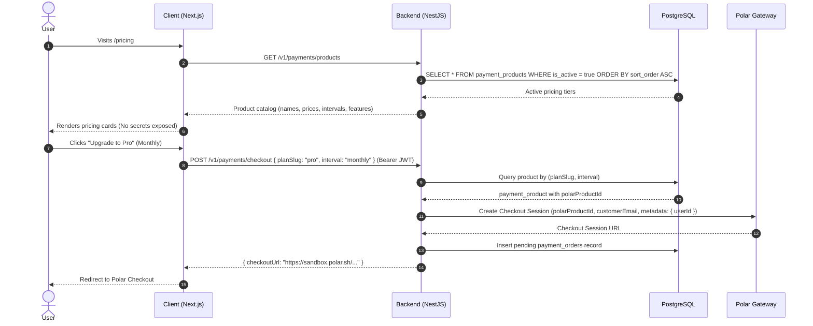
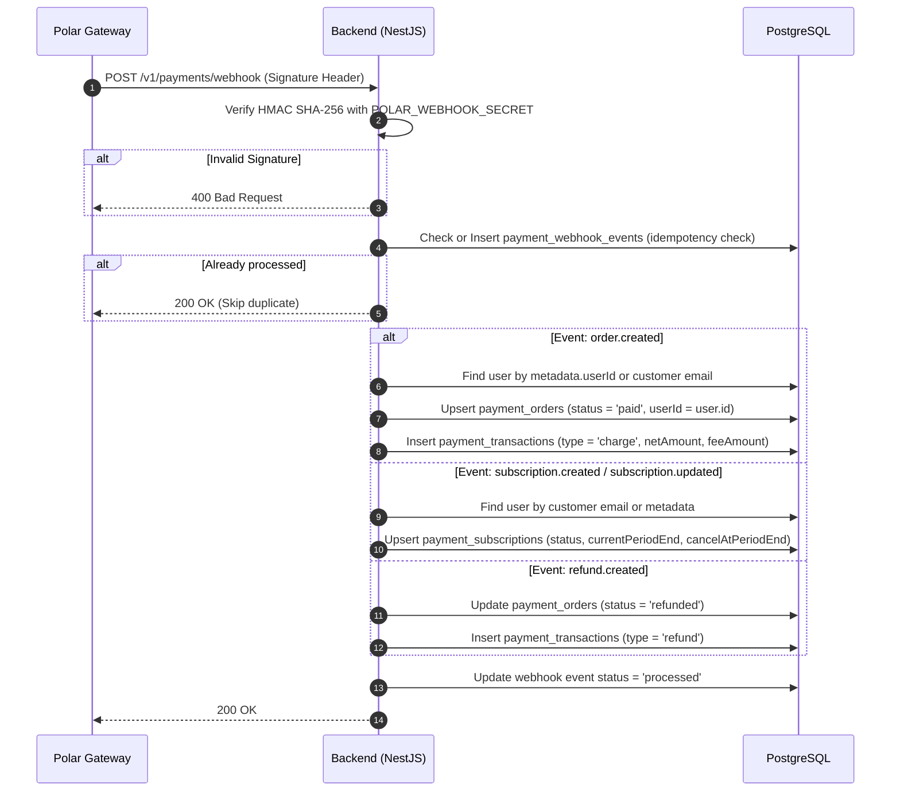
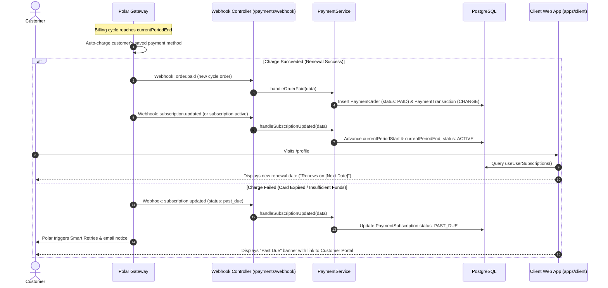
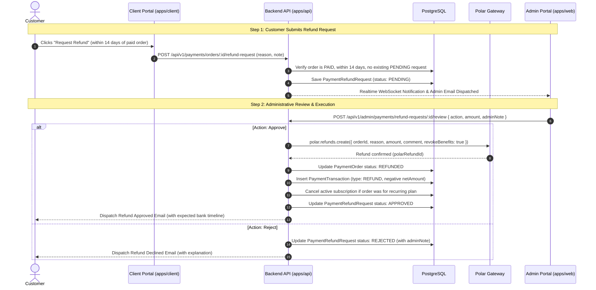

# Payment Architecture & Implementation Guide

This document details the end-to-end architecture, database schema, API workflows, security, and administrative management for the Payment Module integrated with **Polar.sh**.

---

## 1. Architectural Principles & Overview

The payment system follows a **Backend-Driven Architecture** with strict security and isolation guarantees:

1. **Zero Client Secrets**:
   - The frontend (`apps/client`) holds **no** payment provider credentials, webhook secrets, or Polar Product IDs.
   - All pricing tiers, plan metadata, and Polar gateway product IDs are stored and served dynamically from the backend database (`payment_products`).
2. **Catalog-Driven Checkout**:
   - The client application interacts solely using human-readable slugs and billing frequencies: `{ planSlug: 'pro', interval: 'monthly' }`.
   - The backend resolves the corresponding Polar Product ID and handles checkout generation.
3. **Modular Service Separation**:
   - [`ProductService`](file:///apps/api/src/api/payment/services/product.service.ts): Manages plan definitions, tier pricing, feature lists, and Polar Product ID mapping.
   - [`PaymentService`](file:///apps/api/src/api/payment/services/payment.service.ts): Handles checkout orchestration, webhook ingestion, subscription state machines, ledger transactions, and user billing summaries.
4. **Relational Data Integrity**:
   - All payment entities (`payment_orders`, `payment_subscriptions`, `payment_customers`, `payment_transactions`) are strictly linked to the core [`users`](file:///apps/api/src/api/user/entities/user.entity.ts) table via TypeORM `@ManyToOne` foreign keys with `ON DELETE SET NULL`.
5. **Idempotent Webhooks**:
   - Every incoming Polar webhook event is verified via HMAC SHA-256 and tracked in `payment_webhook_events` to prevent duplicate processing.
6. **Extensible Gateway Strategy Pattern (`IPaymentGateway`)**:
   - All gateway-specific communications are encapsulated in dedicated providers implementing [`IPaymentGateway`](file:///apps/api/src/api/payment/interfaces/payment-gateway.interface.ts).
   - Currently powered by [`PolarProvider`](file:///apps/api/src/api/payment/providers/polar.provider.ts) and orchestrated by [`PaymentGatewayFactory`](file:///apps/api/src/api/payment/factories/payment-gateway.factory.ts).
   - Allows seamless plug-and-play addition of future gateways (e.g., VNPAY, MoMo, Stripe) without database schema modifications.

---

## 2. High-Level System Architecture



---

## 3. Database Schema & Data Models

### 3.1. Entity Relationship Diagram



### 3.2. Migration History

1. `1780192650000-create-payment-tables.ts`: Creates baseline tables (`payment_customers`, `payment_orders`, `payment_subscriptions`, `payment_transactions`, `payment_webhook_events`).
2. `1780192750000-create-payment-products-table.ts`: Creates `payment_products` catalog table and seeds default tier plans (`starter`, `pro`, `enterprise`).
3. `1780192850000-link-users-to-payment-tables.ts`: Converts `user_id` columns to `bigint` and creates Foreign Key constraints referencing `users(id)` with `ON DELETE SET NULL ON UPDATE NO ACTION`.
4. `1780192950000-create-payment-refund-requests-table.ts`: Creates `payment_refund_requests` table with foreign key relations to `payment_orders`, `users`, and `admin_users`.

---

## 4. Key Workflows

### 4.1. Dynamic Pricing Display & Checkout Flow



### 4.2. Webhook Ingestion & Fulfillment Flow



### 4.3. Customer Self-Service Portal Flow

Authenticated users can manage their payment methods, view invoices, or cancel subscriptions without contacting support:

1. User clicks **Manage Subscription** on Client portal.
2. Client requests `GET /api/v1/payments/customer-portal` with JWT.
3. Backend looks up user's Polar Customer ID from `payment_customers` (or resolves via email).
4. Backend calls Polar API to generate an authenticated Customer Portal session.
5. Client opens the Polar Customer Portal URL in a secure new tab.

### 4.4. Subscription Renewal & Lifecycle Flow

Subscriptions follow an automated recurring lifecycle managed by Polar as the Merchant of Record:



#### Key Renewal Lifecycle Details:

1. **Auto-Renewal & Fulfillment**: On every billing anniversary (`monthly` or `yearly`), Polar charges the card and emits `order.paid`. The backend creates a new `PaymentOrderEntity` and ledger entry `PaymentTransactionEntity`.
2. **Subscription Period Extension**: `subscription.updated` webhook pushes updated `current_period_start` and `current_period_end` timestamps to the local `payment_subscriptions` record.
3. **Cancellation At Period End**: When a user cancels their subscription in the Customer Portal, Polar sets `cancel_at_period_end = true`. The user retains active feature access until `current_period_end`, at which point Polar fires `subscription.canceled` and the local status transitions to `CANCELED`.
4. **Dunning & Past Due**: When recurring payment attempts fail, the subscription enters `past_due` status. Polar executes automated retry schedules before permanently canceling the subscription.

---

### 4.5. Refund Lifecycle & Administrative Processing

The refund system provides both a customer self-service request pipeline and direct administrative refund capabilities:



#### Refund Policies & Constraints:

- **14-Day Eligibility Window**: Requests are rejected with `400 Bad Request` if submitted later than 14 days post-purchase.
- **Paid Status Requirement**: Only orders with `status: PAID` can be refunded.
- **Pending De-duplication**: An order cannot have more than one `PENDING` refund request at any given time.
- **Partial or Full Refund**: Admins can approve the full purchase amount or specify an adjusted partial amount in cents.
- **Direct Refund**: Admins can initiate refunds directly from the Orders table (`POST /api/v1/admin/payments/orders/:id/direct-refund`) without a customer request.

---

### 4.6. Automated Notifications & Email Dispatch Workflow

The refund subsystem features bidirectional automated alerts across WebSocket and email channels:

#### 1. Real-Time Admin Alerts (On New Refund Request)

- **In-App Realtime Notification**:
  - Filtered by admin preference: `admin.notifications.system !== false`.
  - Dispatches WebSocket event `emitNewNotification` and `emitUnreadCount` (`AdminNotificationType.RefundRequested`).
  - Bell notification indicator lights up immediately in Admin Portal (`apps/web`).
- **Admin Email Notice**:
  - Filtered by admin preference: `admin.notifications.email !== false`.
  - Rendered via Handlebars template [`admin-refund-requested.hbs`](file:///apps/api/src/mail/templates/admin-refund-requested.hbs).
  - Includes Order Number, Customer Email, Requested Amount, Reason, Customer Note, and direct CTA link to `/payments`.

#### 2. Customer Notification (On Review Resolution)

- **Refund Approved**:
  - Rendered via Handlebars template [`customer-refund-reviewed.hbs`](file:///apps/api/src/mail/templates/customer-refund-reviewed.hbs).
  - Details: Order Number, Approved Amount, Support Note, and reassurance explaining the standard **5 to 10 business day** bank processing window.
- **Refund Declined**:
  - Sent via the same template with `isApproved: false`.
  - Details: Order Number, Status `DECLINED`, and the specific reason provided by the reviewing administrator.

---

## 5. Admin Portal Management (`apps/web`)

The Admin Portal provides full operational visibility and configuration controls for billing and payments:

### 5.1. Global Payment Management (`/payments`)

Accessible via the sidebar navigation under **Management -> Payments**:

- **Orders Tab** ([`orders-tab.tsx`](file:///apps/web/src/pages/payments/components/orders-tab.tsx)):
  - Real-time search across order number, customer email, and Polar order ID.
  - Status badges (`PAID`, `PENDING`, `REFUNDED`, `FAILED`, `EXPIRED`).
  - Direct links to associated user profiles (`User #ID`).
  - **Direct Refund Action**: Nút **Refund** trực tiếp trên từng đơn hàng `paid`, mở [`DirectRefundDialog`](file:///apps/web/src/pages/payments/components/direct-refund-dialog.tsx) cho phép Admin hoàn tiền trực tiếp qua Polar API mà không cần khách hàng gửi yêu cầu trước.
- **Subscriptions Tab** ([`subscriptions-tab.tsx`](file:///apps/web/src/pages/payments/components/subscriptions-tab.tsx)):
  - Monitoring of recurring SaaS subscriptions.
  - Active/Cancelled/Past Due status indicators.
  - Renewal tracking (`Period End` and `Auto Renew` status).
- **Transactions Tab** ([`transactions-tab.tsx`](file:///apps/web/src/pages/payments/components/transactions-tab.tsx)):
  - Financial ledger auditing.
  - Breakdowns for Gross Amount, Platform Fee, and Net Settlement Amount.
  - Card brand and last 4 digits tracking.
- **Refund Requests Tab** ([`refund-requests-tab.tsx`](file:///apps/web/src/pages/payments/components/refund-requests-tab.tsx)):
  - Hàng đợi quản lý danh sách yêu cầu hoàn tiền gửi từ khách hàng.
  - Bộ lọc trạng thái: `pending`, `approved`, `rejected`.
  - Hiển thị chi tiết: Mã yêu cầu, đơn hàng, khách hàng, số tiền, lý do và ghi chú của khách.
  - Nút **Review** mở [`ReviewRefundDialog`](file:///apps/web/src/pages/payments/components/review-refund-dialog.tsx) hỗ trợ Approve (toàn phần hoặc tùy chỉnh một phần số tiền) hoặc Reject kèm ghi chú lý do.

### 5.2. Payment Products & Pricing Tier Manager (`/payment-products`)

Accessible under **Management -> Payment Products**:

- Add, update, or deprecate pricing plans dynamically.
- Modify Polar Product IDs for production or sandbox without redeploying code.
- Customize features list (JSON/array), promotional badges (`Popular`, `Free`), and call-to-action text.
- **Composite Unique Constraint**: `(plan_slug, interval)` là unique key. Cho phép sử dụng cùng 1 slug (ví dụ `pro`) cho cả gói `monthly` và `yearly`.
- **Faceted Filters & Search**: Bảng dữ liệu hỗ trợ tìm kiếm theo tên/slug và faceted filter theo `interval` và `isActive` (mặc định lọc `isActive = true` khi tải trang).

### 5.3. User-Specific Payment Audit (`/users/:id/show`)

Integrated into the User Detail view ([`UserPaymentCard`](file:///apps/web/src/pages/users/show/components/user-payment-card.tsx)):

- **Lifetime Value (LTV)**: Total amount spent by the user across all completed orders.
- **Total Orders**: Count of successful purchases.
- **Active Subscription Status**: Summary of the user's active plan, expiry date, and cancellation schedule.
- **History Tables**: Direct view of all subscriptions and recent orders associated with the specific user account.

---

## 6. API Reference

### 6.1. Public / Client Endpoints (`/api/v1/payments`)

| Method | Endpoint                     | Auth                       | Description                                                    |
| :----- | :--------------------------- | :------------------------- | :------------------------------------------------------------- |
| `GET`  | `/products`                  | None                       | Retrieves all active pricing products for public pricing table |
| `POST` | `/checkout`                  | Optional (JWT recommended) | Initiates checkout session by `planSlug` and `interval`        |
| `POST` | `/webhook`                   | Webhook Signature          | Ingests Polar webhook events with idempotency                  |
| `GET`  | `/customer-portal`           | User JWT                   | Generates Polar customer self-service portal link              |
| `GET`  | `/my-orders`                 | User JWT                   | Returns payment orders for current authenticated user          |
| `GET`  | `/my-subscriptions`          | User JWT                   | Returns subscriptions for current authenticated user           |
| `POST` | `/orders/:id/refund-request` | User JWT                   | Submits a refund request for an eligible paid order (14 days)  |
| `GET`  | `/refund-requests`           | User JWT                   | Returns all refund requests submitted by authenticated user    |

### 6.2. Admin Endpoints (`/api/v1/admin/payments`)

Tất cả các endpoint Admin được bảo vệ bởi cả `AdminAuthGuard` và `PoliciesGuard` sử dụng hệ thống CASL RBAC.

| Method   | Endpoint                      | Auth & Required Permission | Description                                                 |
| :------- | :---------------------------- | :------------------------- | :---------------------------------------------------------- |
| `GET`    | `/orders`                     | `read:PAYMENT`             | Paginated list of all customer orders                       |
| `GET`    | `/subscriptions`              | `read:PAYMENT`             | Paginated list of all SaaS subscriptions                    |
| `GET`    | `/transactions`               | `read:PAYMENT`             | Paginated list of financial ledger transactions             |
| `GET`    | `/users/:userId/summary`      | `read:PAYMENT`             | Summary of LTV, active plan, and orders for a specific user |
| `GET`    | `/products`                   | `read:PAYMENT_PRODUCT`     | Paginated list of payment products/tiers                    |
| `GET`    | `/products/:id`               | `read:PAYMENT_PRODUCT`     | Get product configuration by ID                             |
| `GET`    | `/benefits`                   | `read:PAYMENT_PRODUCT`     | Get available Polar benefits for attachment                 |
| `POST`   | `/products/sync-polar`        | `update:PAYMENT_PRODUCT`   | Fetch & sync active products from Polar API                 |
| `POST`   | `/products`                   | `create:PAYMENT_PRODUCT`   | Create a new pricing tier & sync directly to Polar          |
| `PUT`    | `/products/:id`               | `update:PAYMENT_PRODUCT`   | Update pricing tier & sync changes to Polar                 |
| `DELETE` | `/products/:id`               | `delete:PAYMENT_PRODUCT`   | Archive/Delete product adhering to Polar safety constraints |
| `GET`    | `/refund-requests`            | `read:PAYMENT`             | Paginated list of all customer refund requests              |
| `POST`   | `/refund-requests/:id/review` | `update:PAYMENT`           | Reviews (Approves or Rejects) a pending refund request      |
| `POST`   | `/orders/:id/direct-refund`   | `update:PAYMENT`           | Directly refunds a paid order without prior request         |

### 6.3. Two-Way Polar Synchronization & Rules (Strict Polar Docs Adherence)

Admin can manage products directly from the Admin Portal without navigating to Polar dashboard:

1. **Product Creation (`POST /admin/payments/products` -> `POST /v1/products/`)**:
   - Creates the product directly on Polar with fixed or free pricing and visibility (`public` or `private`).
   - Obtains the Polar Product UUID and persists it in PostgreSQL.
   - Attaches selected Polar benefits automatically via `POST /v1/products/{id}/benefits`.
2. **Product Editing (`PUT /admin/payments/products/:id` -> `PATCH /v1/products/{id}`)**:
   - Updates `name`, `description`, `prices`, `metadata`, `visibility`.
   - Synchronizes benefit entitlement updates via `POST /v1/products/{id}/benefits`.
   - **Polar Invariant**: Billing model (`recurring` vs `one_time`) and `interval` (`monthly` vs `yearly`) **cannot be changed** once created on Polar. The UI form disables these fields in edit mode to preserve subscription integrity.
3. **Safe Deletion & Archiving (`DELETE /admin/payments/products/:id`)**:
   - **Rule from Polar Docs**: _"Only products without orders, subscriptions, trials or discounts can be deleted. Products that are in use can only be archived."_
   - When an admin initiates deletion:
     - If the product has orders in `payment_orders`: It is **safely archived** on Polar (`is_archived: true`) and marked `isActive = false` in PostgreSQL. Existing subscribers continue uninterrupted.
     - If the product has zero orders: It is removed from Polar and permanently deleted from PostgreSQL.

---

## 7. Environment Variables

### Backend (`apps/api/.env`)

```env
# Polar Gateway Credentials
POLAR_ACCESS_TOKEN=polar_at_your_access_token_here
POLAR_ORGANIZATION_ID=your-organization-id
POLAR_WEBHOOK_SECRET=your_webhook_secret_here
POLAR_SERVER=sandbox # 'sandbox' for staging/dev, 'production' for live
```

### Client (`apps/client/.env`)

> [!NOTE]
> Client applications **no longer require** any `NEXT_PUBLIC_POLAR_PRODUCT_*` variables. Pricing is resolved automatically via backend API.

---

## 8. Development & Verification Guide

### 8.1. Running Type Checks & Unit Tests

```bash
# Check TypeScript across backend and admin portal
pnpm --filter api check-types
pnpm --filter web-portal check-types

# Run Payment Module Unit Tests
pnpm --filter api test -- payment
```

### 8.2. Verifying Database Schema Synchronization

Verify that TypeORM entities match PostgreSQL schema with zero diff:

```bash
pnpm --filter api migration:generate src/database/migrations/VerifySync
```

_(Should output: `No changes in database schema were found`)_

---

### 8.3. Local Webhook Development via Polar CLI (Official Method)

The official and recommended way to test Polar webhooks locally is using the **[Polar CLI](https://polar.sh/docs)**. The CLI connects directly to Polar via a secure listener and forwards all sandbox events to your localhost server without requiring third-party tunneling services.

#### Step 1: Install the Polar CLI

Install the official CLI on macOS, Linux, or WSL:

```bash
curl -fsSL https://polar.sh/install.sh | bash
```

Verify installation:

```bash
polar --version
```

#### Step 2: Login to Polar Account

Authenticate the CLI session:

```bash
# For Sandbox environment (Default for development)
polar login --sandbox

# Or for Production
polar login
```

A browser window will open to authenticate and authorize the CLI.

#### Step 3: Listen and Forward Webhooks to Local Server

Run the listener pointing to your NestJS payment webhook endpoint:

```bash
polar listen http://localhost:3000/api/v1/payments/webhook
```

When prompted, select your **Organization**.

The CLI will start listening and print your **Webhook Secret** in the terminal:

```text
> Ready! Listening for webhooks...
> Webhook Secret: polar_whsec_xxxxxxxxxxxxxxxxxxxx
```

#### Step 4: Configure Local Environment Variable

Copy the webhook secret from the terminal output into `apps/api/.env`:

```env
# apps/api/.env
POLAR_WEBHOOK_SECRET=polar_whsec_your_secret_from_terminal
```

> [!IMPORTANT]
> Failing to set this exact `POLAR_WEBHOOK_SECRET` will result in `403 Forbidden` (`Invalid Polar webhook signature`) when your application attempts to verify incoming webhook payloads.

Restart your NestJS server to apply the updated secret:

```bash
pnpm --filter api dev
```

#### Step 5: Triggering and Verifying Webhook Events

##### 1. Trigger Test Events via Polar CLI

You can test specific event flows instantly using `polar trigger`:

```bash
# Test order completion
polar trigger order.paid

# Test subscription activation
polar trigger subscription.active

# Test real-time product price/catalog update
polar trigger product.updated
```

##### 2. Complete an End-to-End Test Checkout

1. Open the Client pricing page: `http://localhost:3001/pricing`.
2. Select any plan (Monthly, Yearly, or Lifetime).
3. On the Polar Sandbox checkout page, use the test card details:
   - **Card Number**: `4242 4242 4242 4242`
   - **Expiry Date**: Any future date (e.g., `12/28`)
   - **CVC**: Any 3 digits (`123`)
4. Upon clicking **Pay**, watch the Polar CLI forward `order.paid` and `subscription.created` directly to your local NestJS backend.

##### 3. Check Backend Terminal Logs & Database

Your NestJS server console will display:

```text
[Nest] LOG [PaymentService] Processing Polar webhook event: order.paid (order_paid_...)
[Nest] LOG [PaymentService] Order ORD-... successfully marked as PAID
[Nest] LOG [PaymentService] Financial transaction record created: tx_...
```

All received webhooks are audited in the `payment_webhook_events` PostgreSQL table with status `PROCESSED`.

---

#### Alternative: Using Third-Party Tunnels (ngrok / cloudflared)

If the Polar CLI is unavailable in your environment, you can expose your local port via an HTTPS tunnel:

- **`ngrok`**: `ngrok http 3000` ➔ Set Webhook URL on Polar Dashboard to `https://<ngrok-url>/api/v1/payments/webhook`.
- **`cloudflared`**: `cloudflared tunnel --url http://localhost:3000` ➔ Set Webhook URL to `https://<cf-url>/api/v1/payments/webhook`.
