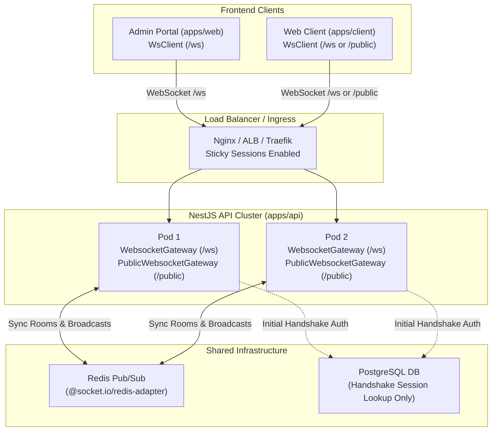

# WebSocket Architecture & Developer Guide

> **Production-Hardened WebSocket Infrastructure** for high-frequency, bidirectional realtime features with multi-pod clustering, thin gateway routing, session revocation sweeps, rate limiting, and end-to-end TypeScript contracts.

---

## 1. Architecture Overview

This monorepo provides a production-grade WebSocket infrastructure built on **Socket.IO v4** and **Redis Pub/Sub** (`@socket.io/redis-adapter`). The architecture decouples realtime communication into two dedicated namespaces:

1. **`/ws` (Authenticated Namespace)**:
   - Dedicated to authenticated users (`admin` and `user`).
   - Performs JWT validation and active session verification during the handshake.
   - Enforces periodic O(1) session activity sweeps to disconnect revoked sessions without querying PostgreSQL.
   - Automatically routes connections into private rooms (`admin:<id>`, `user:<id>`).
   - Protected by rate limiting (`WsThrottleGuard`) and graceful server shutdown hooks.

2. **`/public` (Unauthenticated Namespace)**:
   - Designed for anonymous guests and open data streaming (e.g., market tickers, live metrics, public announcements).
   - Implements the **Topic Subscription Pattern** (`public:subscribe`, `public:unsubscribe`).
   - Zero authentication overhead for high-throughput public consumption.



---

## 2. Core Architectural Pillars

### 2.1. Thin Gateway Pattern

[`WebsocketGateway`](file:///home/crodic/personal/turborepo/apps/api/src/websocket/websocket.gateway.ts) is deliberately kept thin:

- It does not maintain heavy custom state or run complex in-memory loops.
- It delegates auth validation to [`WebsocketAuthService`](file:///home/crodic/personal/turborepo/apps/api/src/websocket/websocket-auth.service.ts).
- It routes socket connections into user/admin rooms and handles socket lifecycle cleanly.

### 2.2. Zero Database Exhaustion Session Validation

- **Handshake Phase**: Queries PostgreSQL only once to verify user identity and session validity.
- **Connected Phase**: Background sweep runs every 30 seconds. Instead of hitting PostgreSQL for every connected socket, it checks cached Redis session state in O(1) time. Any revoked session is disconnected immediately.

### 2.3. Rate Limiting (`WsThrottleGuard`)

WebSocket endpoints are protected by [`WsThrottleGuard`](file:///home/crodic/personal/turborepo/apps/api/src/websocket/guards/ws-throttle.guard.ts) using a sliding window (max 60 events per 10s per socket) to prevent message flooding and abuse.

### 2.4. Graceful Shutdown (`OnApplicationShutdown`)

On server restarts or container termination (`SIGTERM`), `WebsocketGateway` intercepts the shutdown signal, emits a `ws:shutdown` message to connected clients, and closes all sockets cleanly so clients can immediately reconnect to another healthy pod.

---

## 3. Type Safety & Event Contracts

All WebSocket events in the monorepo are strongly typed in [`apps/api/src/websocket/events.ts`](file:///home/crodic/personal/turborepo/apps/api/src/websocket/events.ts):

```typescript
export interface ServerToClientEvents {
  'ws:pong': (data: { at: string }) => void;
  'ws:unauthorized': (data: { message: string }) => void;
  'ws:error': (data: { code: string; message: string }) => void;
  'ws:shutdown': (data: { message: string }) => void;
  'room:joined': (data: { room: string }) => void;
  'room:left': (data: { room: string }) => void;
}

export interface ClientToServerEvents {
  'ws:ping': () => void;
  'room:join': (room: string) => void;
  'room:leave': (room: string) => void;
}

export interface SocketData {
  principal: WsPrincipal;
  rateLimit?: {
    count: number;
    resetAt: number;
  };
}
```

---

## 4. Backend Service: `WebsocketService`

[`WebsocketService`](file:///home/crodic/personal/turborepo/apps/api/src/websocket/websocket.service.ts) is `@Global()`. You can inject it directly into any service or controller without re-importing `WebsocketModule`.

### API Methods

```typescript
export class WebsocketService {
  /**
   * Send a private event to a specific Admin user across all cluster pods.
   */
  emitToAdmin(adminId: number | string, event: string, data: unknown): void;

  /**
   * Send a private event to a specific Customer / End-User across all cluster pods.
   */
  emitToUser(userId: number | string, event: string, data: unknown): void;

  /**
   * Send an event to all sockets in a specific room.
   */
  emitToRoom(room: string, event: string, data: unknown): void;

  /**
   * Broadcast an event to all authenticated sockets connected to /ws.
   */
  broadcast(event: string, data: unknown): void;

  /**
   * Publish a message to a public topic on /public (Topic Subscription Pattern).
   */
  emitToPublicTopic(topic: string, event: string, data: unknown): void;

  /**
   * Broadcast an event to all anonymous sockets connected to /public.
   */
  broadcastPublic(event: string, data: unknown): void;
}
```

---

## 5. Frontend Client Architecture (`WsClient`)

Both frontend applications use the resilient TypeScript [`WsClient`](file:///home/crodic/personal/turborepo/apps/web/src/lib/ws-client.ts) wrapper around `socket.io-client`:

- **Automatic Reconnect**: Exponential backoff reconnect logic.
- **Silent Token Refresh**: Re-authenticates seamlessly when access token expires without triggering full page reloads.
- **Document Visibility Awareness**: Slows down or pauses heartbeat pings when the browser tab is hidden in the background.

### 5.1. Admin Portal (`apps/web`)

Wrap your layout with `SocketProvider` and consume the socket using `useSocket()`:

```tsx
import { useEffect } from 'react';
import { useSocket } from '@/context/socket-context';

export function LiveActivityWatcher() {
  const socket = useSocket();

  useEffect(() => {
    if (!socket) return;

    const handleUpdate = (payload: { entityId: number; action: string }) => {
      console.log('Realtime event received:', payload);
    };

    socket.on('activity:update', handleUpdate);

    // CRITICAL: Always clean up listener on unmount
    return () => {
      socket.off('activity:update', handleUpdate);
    };
  }, [socket]);

  return <div>Monitoring Activity...</div>;
}
```

### 5.2. Public Topic Subscriptions (`/public`)

For unauthenticated data streams:

```typescript
import { getPublicWsClient } from '@/lib/ws-client';
import { useEffect, useState } from 'react';

export function LiveMarketTicker() {
  const [data, setData] = useState<unknown>(null);

  useEffect(() => {
    const client = getPublicWsClient();

    void client.connect().then(() => {
      client.subscribeTopic('market:btc');
    });

    const handleUpdate = (payload: unknown) => {
      setData(payload);
    };

    client.on('market:update', handleUpdate);

    return () => {
      client.unsubscribeTopic('market:btc');
      client.off('market:update', handleUpdate);
    };
  }, []);

  return <div>{JSON.stringify(data)}</div>;
}
```

---

## 6. Practical Guide: How to Use WebSocket (Concrete Examples)

This section shows exact, copy-pasteable patterns for the two most common realtime use cases.

---

### Case A: Server Emitting to a Specific User or Admin (e.g. Order Status Update)

Use this pattern when a backend business service needs to notify a specific user or admin in real time (e.g., after a background job completes or an order is approved).

#### 1. Backend (`apps/api`): Inject `WebsocketService` and Emit

In any NestJS service, inject `WebsocketService` (available globally):

```typescript
// apps/api/src/api/order/order.service.ts
import { WebsocketService } from '@/websocket/websocket.service';
import { Injectable } from '@nestjs/common';

@Injectable()
export class OrderService {
  constructor(private readonly wsService: WebsocketService) {}

  async markOrderShipped(orderId: number, customerUserId: number) {
    // 1. Perform database update...

    // 2. Emit event directly to the customer:
    this.wsService.emitToUser(customerUserId, 'order:updated', {
      orderId,
      status: 'SHIPPED',
      updatedAt: new Date().toISOString(),
    });

    // 3. Or emit to all online administrators:
    this.wsService.emitToRoom('admin:channel', 'admin:order_shipped', {
      orderId,
      shippedBy: 'DHL',
    });
  }
}
```

#### 2. Frontend (`apps/web` or `apps/client`): Listen and React

In your React component, use `useSocket()`:

```tsx
// apps/client/src/components/order/order-status-card.tsx
import { useEffect } from 'react';
import { useSocket } from '@/context/socket-context';
import { useQueryClient } from '@tanstack/react-query';
import { toast } from 'sonner';

export function OrderStatusCard({ orderId }: { orderId: number }) {
  const socket = useSocket();
  const queryClient = useQueryClient();

  useEffect(() => {
    if (!socket) return;

    const handleOrderUpdate = (payload: {
      orderId: number;
      status: string;
    }) => {
      if (payload.orderId !== orderId) return;

      toast.info(`Order status updated: ${payload.status}`);
      // Invalidate React Query cache to re-fetch fresh order data:
      queryClient.invalidateQueries({ queryKey: ['orders', orderId] });
    };

    socket.on('order:updated', handleOrderUpdate);

    // CRITICAL: Always clean up listener on unmount to prevent memory leaks
    return () => {
      socket.off('order:updated', handleOrderUpdate);
    };
  }, [socket, orderId, queryClient]);

  return <div>Order #{orderId} Status Tracking</div>;
}
```

---

### Case B: Full Two-Way Interactive Room (e.g. Live Room Chat / Support)

Use this pattern when multiple clients join a room and send messages back and forth in real time.

#### 1. Declare Event Types (`apps/api/src/websocket/events.ts`)

Add your event signatures to the typed maps:

```typescript
// apps/api/src/websocket/events.ts
export interface ClientToServerEvents {
  'ws:ping': () => void;
  'room:join': (room: string) => void;
  'room:leave': (room: string) => void;
  // NEW: Client sends a message to room
  'chat:send_message': (data: { room: string; content: string }) => void;
}

export interface ServerToClientEvents {
  'room:joined': (data: { room: string }) => void;
  'room:left': (data: { room: string }) => void;
  // NEW: Server broadcasts message to all participants in room
  'chat:new_message': (data: {
    room: string;
    content: string;
    senderId: string;
    senderName: string;
    sentAt: string;
  }) => void;
}
```

#### 2. Add Handler in Gateway (`apps/api/src/websocket/websocket.gateway.ts`)

Add the `@SubscribeMessage` handler to `WebsocketGateway`:

```typescript
// apps/api/src/websocket/websocket.gateway.ts
@UseGuards(WsThrottleGuard)
@SubscribeMessage('chat:send_message')
async handleChatMessage(
  @ConnectedSocket() client: TypedSocket,
  @MessageBody() data: { room: string; content: string },
) {
  const principal = client.data.principal;
  if (!principal || !data.room || !data.content?.trim()) return;

  const payload = {
    room: data.room,
    content: data.content.trim(),
    senderId: String(principal.id),
    senderName: principal.fullName || principal.email,
    sentAt: new Date().toISOString(),
  };

  // Broadcast to everyone in the room (including or excluding sender)
  this.websocketService.emitToRoom(data.room, 'chat:new_message', payload);
}
```

#### 3. Frontend Chat Component (`apps/web` or `apps/client`)

Join the room on mount, send messages with `socket.emit`, listen with `socket.on`, and leave the room on unmount:

```tsx
import { useEffect, useState } from 'react';
import { useSocket } from '@/context/socket-context';

type ChatMessage = {
  room: string;
  content: string;
  senderId: string;
  senderName: string;
  sentAt: string;
};

export function LiveChatRoom({ roomId }: { roomId: string }) {
  const socket = useSocket();
  const [messages, setMessages] = useState<ChatMessage[]>([]);
  const [input, setInput] = useState('');

  useEffect(() => {
    if (!socket) return;

    // 1. Join room when entering component
    socket.emit('room:join', roomId);

    // 2. Listen for incoming messages
    const handleNewMessage = (msg: ChatMessage) => {
      if (msg.room === roomId) {
        setMessages((prev) => [...prev, msg]);
      }
    };
    socket.on('chat:new_message', handleNewMessage);

    // 3. Leave room and deregister listener on unmount
    return () => {
      socket.emit('room:leave', roomId);
      socket.off('chat:new_message', handleNewMessage);
    };
  }, [socket, roomId]);

  const handleSend = () => {
    if (!socket || !input.trim()) return;
    socket.emit('chat:send_message', { room: roomId, content: input });
    setInput('');
  };

  return (
    <div className="flex flex-col h-96 border rounded-lg p-4">
      <div className="flex-1 overflow-y-auto space-y-2">
        {messages.map((m, idx) => (
          <div key={idx} className="text-sm">
            <span className="font-semibold text-primary">{m.senderName}: </span>
            <span>{m.content}</span>
          </div>
        ))}
      </div>
      <div className="flex gap-2 mt-2">
        <input
          value={input}
          onChange={(e) => setInput(e.target.value)}
          onKeyDown={(e) => e.key === 'Enter' && handleSend()}
          placeholder="Type a message..."
          className="flex-1 px-3 py-1 border rounded"
        />
        <button
          onClick={handleSend}
          className="px-4 py-1 bg-primary text-white rounded"
        >
          Send
        </button>
      </div>
    </div>
  );
}
```

---

## 7. Production Deployment & Operational Rules

1. **Sticky Sessions**: When running multiple API pods behind Nginx, AWS ALB, or Cloudflare, configure session affinity (sticky cookies) so the initial Socket.IO HTTP long-polling handshake connects to the same pod before upgrading to pure WebSocket.
2. **Listener Cleanup**: Always deregister listeners (`socket.off`) in component unmount functions to prevent memory leaks and multiplied event handlers.
3. **Signal over Payload**: Emit lightweight IDs or status codes (`{ orderId: 10, status: 'PROCESSED' }`) and let React Query invalidate and fetch cached details.
4. **Public Topic Security**: Never emit sensitive user information, emails, or internal database keys to the `/public` namespace.
