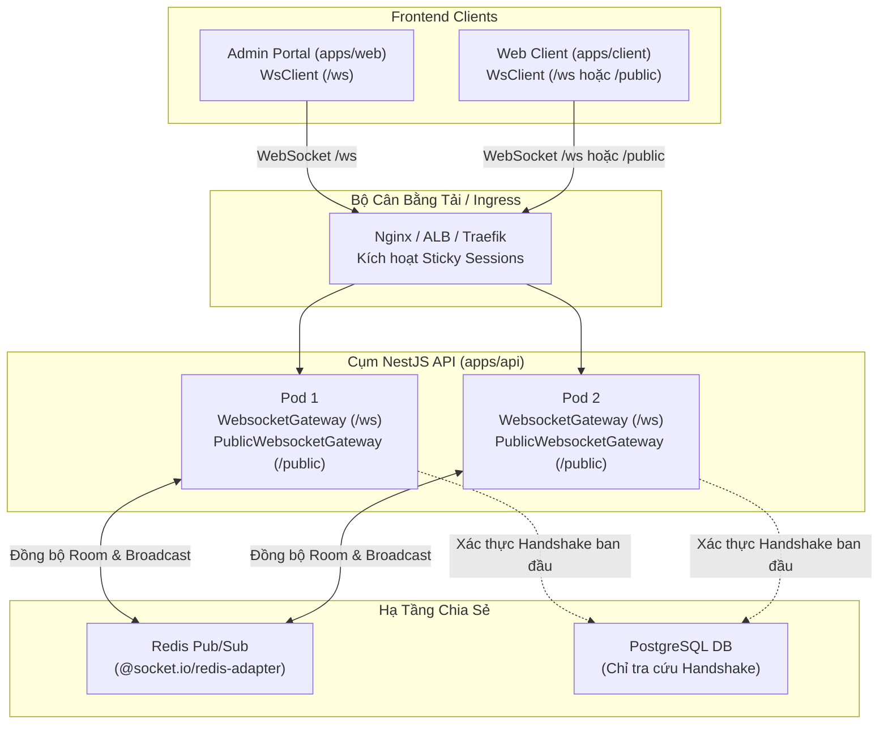

# Kiến Trúc WebSocket & Hướng Dẫn Lập Trình Viên

> [English](websocket.md) | **Tiếng Việt**
>
> **Hạ tầng WebSocket chuẩn Production** cho các tính năng thời gian thực hai chiều tần suất cao, hỗ trợ cụm đa pod (multi-pod clustering), định tuyến thin gateway, quét thu hồi phiên tức thời, giới hạn tần suất (rate limiting) và giao ước kiểu dữ liệu TypeScript đầu-cuối.

---

## 1. Tổng Quan Kiến Trúc

Monorepo này cung cấp hạ tầng WebSocket chuẩn production xây dựng trên **Socket.IO v4** và **Redis Pub/Sub** (`@socket.io/redis-adapter`). Kiến trúc phân tách giao tiếp thời gian thực thành hai namespace chuyên biệt:

1. **`/ws` (Namespace Xác Thực)**:
   - Dành riêng cho người dùng đã đăng nhập (`admin` và `user`).
   - Kiểm tra JWT và tính hợp lệ của session trong quá trình handshake.
   - Định kỳ quét trạng thái phiên với độ phức tạp O(1) để ngắt kết nối các session đã bị thu hồi mà không cần truy vấn vào PostgreSQL.
   - Tự động gom socket vào các phòng riêng (`admin:<id>`, `user:<id>`).
   - Được bảo vệ bởi guard giới hạn tần suất (`WsThrottleGuard`) và hook tắt server an toàn (graceful shutdown).

2. **`/public` (Namespace Công Khai)**:
   - Dành cho khách ẩn danh và luồng dữ liệu mở (ví dụ: bảng giá thị trường, chỉ số trực tiếp, thông báo hệ thống).
   - Triển khai mô hình **Topic Subscription Pattern** (`public:subscribe`, `public:unsubscribe`).
   - Không tốn chi phí xác thực, tối ưu cho luồng tiêu thụ dữ liệu lớn của công chúng.



---

## 2. Các Trụ Cột Kiến Trúc Cốt Lõi

### 2.1. Mô Hình Thin Gateway

[`WebsocketGateway`](file:///apps/api/src/websocket/websocket.gateway.ts) được giữ ở mức tinh gọn:

- Không duy trì trạng thái tùy chỉnh nặng nề hoặc chạy các vòng lặp phức tạp trong bộ nhớ.
- Ủy quyền logic xác thực cho [`WebsocketAuthService`](file:///apps/api/src/websocket/websocket-auth.service.ts).
- Định tuyến các kết nối socket vào phòng của user/admin và quản lý vòng đời socket sạch sẽ.

### 2.2. Kiểm Tra Phiên Làm Việc Không Làm Cạn Kiệt Database

- **Giai đoạn Handshake**: Chỉ truy vấn PostgreSQL một lần duy nhất để xác minh danh tính người dùng và tính hợp lệ của phiên.
- **Giai đoạn Đang Kết Nối**: Tiến trình ngầm chạy mỗi 30 giây một lần. Thay vì truy vấn PostgreSQL cho từng socket đang kết nối, nó kiểm tra trạng thái phiên được lưu đệm trong Redis với thời gian O(1). Mọi phiên đã bị thu hồi sẽ bị ngắt kết nối ngay lập tức.

### 2.3. Giới Hạn Tần Suất (`WsThrottleGuard`)

Các endpoint WebSocket được bảo vệ bởi [`WsThrottleGuard`](file:///apps/api/src/websocket/guards/ws-throttle.guard.ts) sử dụng kỹ thuật sliding window (tối đa 60 sự kiện mỗi 10 giây trên mỗi socket) để ngăn chặn việc spam tin nhắn và lạm dụng tài nguyên.

### 2.4. Tắt Ứng Dụng An Toàn (`OnApplicationShutdown`)

Khi máy chủ khởi động lại hoặc container bị chấm dứt (`SIGTERM`), `WebsocketGateway` đón nhận tín hiệu shutdown, phát thông điệp `ws:shutdown` tới các client đang kết nối và đóng socket một cách êm đẹp để client có thể kết nối ngay sang một pod hoạt động khác.

---

## 3. An Toàn Kiểu Dữ Liệu & Hợp Đồng Sự Kiện

Toàn bộ sự kiện WebSocket trong monorepo đều được định kiểu chặt chẽ trong [`apps/api/src/websocket/events.ts`](file:///apps/api/src/websocket/events.ts):

```typescript
export interface ServerToClientEvents {
  'ws:pong': (data: { at: string }) => void;
  'ws:unauthorized': (data: { message: string }) => void;
  'ws:error': (data: { code: string; message: string }) => void;
  'ws:shutdown': (data: { message: string }) => void;
  'room:joined': (data: { room: string }) => void;
  'room:left': (data: { room: string }) => void;
}

export interface ClientToServerEvents {
  'ws:ping': () => void;
  'room:join': (room: string) => void;
  'room:leave': (room: string) => void;
}

export interface SocketData {
  principal: WsPrincipal;
  rateLimit?: {
    count: number;
    resetAt: number;
  };
}
```

---

## 4. Service Phía Backend: `WebsocketService`

[`WebsocketService`](file:///apps/api/src/websocket/websocket.service.ts) được gắn `@Global()`. Bạn có thể inject trực tiếp vào bất kỳ service hoặc controller nào mà không cần import lại `WebsocketModule`.

### Các Phương Thức API

```typescript
export class WebsocketService {
  /**
   * Gửi sự kiện riêng tư tới một người dùng Admin cụ thể trên toàn bộ cụm pod.
   */
  emitToAdmin(adminId: number | string, event: string, data: unknown): void;

  /**
   * Gửi sự kiện riêng tư tới một Khách hàng / End-User cụ thể trên toàn bộ cụm pod.
   */
  emitToUser(userId: number | string, event: string, data: unknown): void;

  /**
   * Gửi sự kiện tới tất cả socket trong một phòng cụ thể.
   */
  emitToRoom(room: string, event: string, data: unknown): void;

  /**
   * Broadcast một sự kiện tới tất cả socket đã xác thực đang kết nối vào /ws.
   */
  broadcast(event: string, data: unknown): void;

  /**
   * Xuất bản tin nhắn tới một chủ đề công khai trên /public (Topic Subscription Pattern).
   */
  emitToPublicTopic(topic: string, event: string, data: unknown): void;

  /**
   * Broadcast sự kiện tới tất cả socket ẩn danh đang kết nối vào /public.
   */
  broadcastPublic(event: string, data: unknown): void;
}
```

---

## 5. Kiến Trúc Phía Frontend Client (`WsClient`)

Cả hai ứng dụng frontend đều sử dụng lớp bọc TypeScript kiên cường [`WsClient`](file:///apps/web/src/lib/ws-client.ts) xung quanh `socket.io-client`:

- **Tự động kết nối lại**: Cơ chế kết nối lại với độ trễ lũy thừa (exponential backoff).
- **Làm mới Token trong im lặng (Silent Refresh)**: Tự động tái xác thực khi access token hết hạn mà không cần tải lại toàn bộ trang.
- **Nhận biết trạng thái hiển thị của Tab (Page Visibility)**: Tự động giảm tần suất hoặc tạm dừng gửi heartbeat ping khi tab trình duyệt đang ẩn ở chế độ nền.

### 5.1. Admin Portal (`apps/web`)

Bọc layout của bạn bằng `SocketProvider` và sử dụng socket thông qua hook `useSocket()`:

```tsx
import { useEffect } from 'react';
import { useSocket } from '@/context/socket-context';

export function LiveActivityWatcher() {
  const socket = useSocket();

  useEffect(() => {
    if (!socket) return;

    const handleUpdate = (payload: { entityId: number; action: string }) => {
      console.log('Nhận được sự kiện realtime:', payload);
    };

    socket.on('activity:update', handleUpdate);

    // QUAN TRỌNG: Luôn dọn dẹp listener khi unmount để tránh rò rỉ bộ nhớ
    return () => {
      socket.off('activity:update', handleUpdate);
    };
  }, [socket]);

  return <div>Đang theo dõi hoạt động...</div>;
}
```

### 5.2. Đăng Ký Chủ Đề Công Khai (`/public`)

Dành cho các luồng dữ liệu không yêu cầu xác thực:

```typescript
import { getPublicWsClient } from '@/lib/ws-client';
import { useEffect, useState } from 'react';

export function LiveMarketTicker() {
  const [data, setData] = useState<unknown>(null);

  useEffect(() => {
    const client = getPublicWsClient();

    void client.connect().then(() => {
      client.subscribeTopic('market:btc');
    });

    const handleUpdate = (payload: unknown) => {
      setData(payload);
    };

    client.on('market:update', handleUpdate);

    return () => {
      client.unsubscribeTopic('market:btc');
      client.off('market:update', handleUpdate);
    };
  }, []);

  return <div>{JSON.stringify(data)}</div>;
}
```

---

## 6. Hướng Dẫn Thực Hành: Ví Dụ Cụ Thể

### Trường Hợp A: Server Gửi Tới Một User Hoặc Admin Cụ Thể (Ví dụ: Cập Nhật Trạng Thái Đơn Hàng)

Sử dụng mô hình này khi service nghiệp vụ backend cần thông báo cho một người dùng cụ thể trong thời gian thực (ví dụ: sau khi job chạy nền hoàn thành hoặc đơn hàng được duyệt).

#### 1. Backend (`apps/api`): Inject `WebsocketService` và Emit

```typescript
// apps/api/src/api/order/order.service.ts
import { WebsocketService } from '@/websocket/websocket.service';
import { Injectable } from '@nestjs/common';

@Injectable()
export class OrderService {
  constructor(private readonly wsService: WebsocketService) {}

  async markOrderShipped(orderId: number, customerUserId: number) {
    // 1. Cập nhật dữ liệu vào database...

    // 2. Phát sự kiện trực tiếp tới khách hàng:
    this.wsService.emitToUser(customerUserId, 'order:updated', {
      orderId,
      status: 'SHIPPED',
      updatedAt: new Date().toISOString(),
    });

    // 3. Hoặc phát tới tất cả admin đang online:
    this.wsService.emitToRoom('admin:channel', 'admin:order_shipped', {
      orderId,
      shippedBy: 'DHL',
    });
  }
}
```

#### 2. Frontend (`apps/web` hoặc `apps/client`): Lắng Nghe và Phản Hồi

```tsx
// apps/client/src/components/order/order-status-card.tsx
import { useEffect } from 'react';
import { useSocket } from '@/context/socket-context';
import { useQueryClient } from '@tanstack/react-query';
import { toast } from 'sonner';

export function OrderStatusCard({ orderId }: { orderId: number }) {
  const socket = useSocket();
  const queryClient = useQueryClient();

  useEffect(() => {
    if (!socket) return;

    const handleOrderUpdate = (payload: {
      orderId: number;
      status: string;
    }) => {
      if (payload.orderId !== orderId) return;

      toast.info(`Trạng thái đơn hàng cập nhật: ${payload.status}`);
      // Invalidate React Query cache để tự động fetch lại dữ liệu mới:
      queryClient.invalidateQueries({ queryKey: ['orders', orderId] });
    };

    socket.on('order:updated', handleOrderUpdate);

    // QUAN TRỌNG: Luôn dọn dẹp listener khi unmount để tránh rò rỉ bộ nhớ
    return () => {
      socket.off('order:updated', handleOrderUpdate);
    };
  }, [socket, orderId, queryClient]);

  return <div>Theo dõi đơn hàng #{orderId}</div>;
}
```

---

### Trường Hợp B: Phòng Tương Tác Hai Chiều (Ví dụ: Chat Phòng / Hỗ Trợ Trực Tuyến)

#### 1. Khai Báo Kiểu Sự Kiện (`apps/api/src/websocket/events.ts`)

```typescript
// apps/api/src/websocket/events.ts
export interface ClientToServerEvents {
  'ws:ping': () => void;
  'room:join': (room: string) => void;
  'room:leave': (room: string) => void;
  // Client gửi tin nhắn vào phòng
  'chat:send_message': (data: { room: string; content: string }) => void;
}

export interface ServerToClientEvents {
  'room:joined': (data: { room: string }) => void;
  'room:left': (data: { room: string }) => void;
  // Server broadcast tin nhắn tới toàn bộ thành viên trong phòng
  'chat:new_message': (data: {
    room: string;
    content: string;
    senderId: string;
    senderName: string;
    sentAt: string;
  }) => void;
}
```

#### 2. Thêm Handler trong Gateway (`apps/api/src/websocket/websocket.gateway.ts`)

```typescript
// apps/api/src/websocket/websocket.gateway.ts
@UseGuards(WsThrottleGuard)
@SubscribeMessage('chat:send_message')
async handleChatMessage(
  @ConnectedSocket() client: TypedSocket,
  @MessageBody() data: { room: string; content: string },
) {
  const principal = client.data.principal;
  if (!principal || !data.room || !data.content?.trim()) return;

  const payload = {
    room: data.room,
    content: data.content.trim(),
    senderId: String(principal.id),
    senderName: principal.fullName || principal.email,
    sentAt: new Date().toISOString(),
  };

  this.websocketService.emitToRoom(data.room, 'chat:new_message', payload);
}
```

#### 3. Component Chat Phía Frontend

```tsx
import { useEffect, useState } from 'react';
import { useSocket } from '@/context/socket-context';

type ChatMessage = {
  room: string;
  content: string;
  senderId: string;
  senderName: string;
  sentAt: string;
};

export function LiveChatRoom({ roomId }: { roomId: string }) {
  const socket = useSocket();
  const [messages, setMessages] = useState<ChatMessage[]>([]);
  const [input, setInput] = useState('');

  useEffect(() => {
    if (!socket) return;

    // 1. Tham gia phòng khi component hiển thị
    socket.emit('room:join', roomId);

    // 2. Lắng nghe tin nhắn mới đến
    const handleNewMessage = (msg: ChatMessage) => {
      if (msg.room === roomId) {
        setMessages((prev) => [...prev, msg]);
      }
    };
    socket.on('chat:new_message', handleNewMessage);

    // 3. Rời phòng và hủy listener khi component unmount
    return () => {
      socket.emit('room:leave', roomId);
      socket.off('chat:new_message', handleNewMessage);
    };
  }, [socket, roomId]);

  const handleSend = () => {
    if (!socket || !input.trim()) return;
    socket.emit('chat:send_message', { room: roomId, content: input });
    setInput('');
  };

  return (
    <div className="flex flex-col h-96 border rounded-lg p-4">
      <div className="flex-1 overflow-y-auto space-y-2">
        {messages.map((m, idx) => (
          <div key={idx} className="text-sm">
            <span className="font-semibold text-primary">{m.senderName}: </span>
            <span>{m.content}</span>
          </div>
        ))}
      </div>
      <div className="flex gap-2 mt-2">
        <input
          value={input}
          onChange={(e) => setInput(e.target.value)}
          onKeyDown={(e) => e.key === 'Enter' && handleSend()}
          placeholder="Nhập tin nhắn..."
          className="flex-1 px-3 py-1 border rounded"
        />
        <button
          onClick={handleSend}
          className="px-4 py-1 bg-primary text-white rounded"
        >
          Gửi
        </button>
      </div>
    </div>
  );
}
```

---

## 7. Triển Khai Production & Quy Tắc Vận Hành

1. **Sticky Sessions**: Khi chạy nhiều pod API phía sau Nginx, AWS ALB hoặc Cloudflare, hãy cấu hình session affinity (sticky cookies) để handshake HTTP long-polling ban đầu của Socket.IO luôn kết nối vào cùng 1 pod trước khi nâng cấp lên kết nối WebSocket thuần.
2. **Dọn dẹp Listener**: Luôn hủy đăng ký sự kiện (`socket.off`) trong hàm cleanup của component để tránh rò rỉ bộ nhớ.
3. **Ưu tiên Tín hiệu hơn Dữ liệu nặng (Signal over Payload)**: Nên phát ID gọn nhẹ hoặc mã trạng thái (`{ orderId: 10, status: 'PROCESSED' }`) và để React Query đảm nhiệm việc fetch dữ liệu chi tiết có cache.
4. **Bảo mật Chủ đề Công khai**: Tuyệt đối không phát thông tin nhạy cảm của người dùng, email hay ID nội bộ vào namespace `/public`.
